# TIỂU LUẬN MÔN HỌC

HỌC VIỆN CÔNG NGHỆ BƯU CHÍNH VIỄN THÔNG

KHOA CÔNG NGHỆ THÔNG TIN

PHÁT TRIỂN CÁC HỆ THỐNG THÔNG MINH

Từ lịch sử AI đến ML, CNN, RNN và ứng dụng triển khai

Sinh viên: Nguyễn Minh Vinh

Mã sinh viên: B23DCCN934

Lớp: D23CTPM01

Giảng viên: PGS.TS Trần Đình Quế

Học kỳ 1, năm học 2026 - 2027

Hà Nội, tháng 10 năm 2026


# MỤC LỤC


# TÓM TẮT

Tiểu luận trình bày sự phát triển của trí tuệ nhân tạo và liên hệ các ý tưởng học máy với một hệ thống thực nghiệm có thể chạy lại. Nội dung gồm lịch sử AI, các kỹ thuật machine learning cơ bản, mạng tích chập và mạng hồi tiếp. Trọng tâm thực nghiệm là đối chiếu ba cách cài đặt cùng một cấu trúc: NumPy scratch, TensorFlow / Keras và PyTorch. Cách tổ chức được tham khảo từ tiểu luận của Triệu Tuấn Anh; toàn bộ mô hình, bảng số liệu và checkpoint ở đây được xây dựng và huấn luyện độc lập.

Sáu dataset được sử dụng theo ba chương: CDC Diabetes và giá nhà Việt Nam cho MLP; MNIST và EuroSAT cho CNN; AAPL và Online Retail II cho RNN. Mỗi dataset có nguồn, quy mô gốc, quy mô thực nghiệm, input / output mẫu, phân bố và nhận xét. Chương lịch sử bổ sung ba dataset đại diện nhằm liên hệ sự thay đổi từ dữ liệu bảng sang ảnh và chuỗi thời gian.

Mười tám mô hình trong phép so sánh chính được train từ đầu. Bản scratch có forward, loss, backward và cập nhật SGD; gradient được kiểm tra bằng sai phân hữu hạn và đối chiếu autograd. Các framework dùng cùng initialization, thứ tự batch, cấu trúc, split và tiêu chí validation. Hai bài ML còn có baseline tuyến tính và random forest. Kết quả tương đương giữa framework được giải thích từ điều kiện đối chiếu, không diễn giải thành ba thuật toán có bản chất khác nhau.

Sản phẩm gồm năm notebook đã chạy, mã nguồn, báo cáo, checkpoint, biểu đồ và web Flask có sáu bài toán. Web dùng trọng số thật và phép tính NumPy đã kiểm chứng; không huấn luyện lại tại request. Repository có Blueprint Render. Trạng thái URL live được ghi riêng để phân biệt cấu hình triển khai với dịch vụ đã được kiểm tra online.


# MỞ ĐẦU - 0.1. Bối cảnh và lý do chọn đề tài

Trí tuệ nhân tạo được sử dụng trong nhiều hệ thống xử lý thông tin, nhưng việc dùng một thư viện để gọi fit và predict chưa đủ để hiểu mô hình hoạt động như thế nào. Một kết quả trên màn hình có thể bị chi phối bởi cách chia dữ liệu, biến đầu vào, đơn vị target, độ lệch lớp hoặc việc dùng nhầm thông tin tương lai. Vì vậy, phát triển hệ thống thông minh cần kết hợp kiến thức thuật toán với quy trình dữ liệu và kiểm chứng phần mềm.

Các kỹ thuật trong học phần cung cấp những giả định khác nhau về cấu trúc dữ liệu. MLP nhận vector đặc trưng; CNN khai thác quan hệ cục bộ trên ảnh; RNN cập nhật trạng thái theo chuỗi. Chúng đều là những hàm có tham số được tối ưu từ dữ liệu, nhưng cách chia sẻ trọng số và truyền thông tin khác nhau. Hiểu sự khác biệt này giúp lựa chọn mô hình có căn cứ thay vì chỉ tăng số lớp hoặc thay tên kiến trúc.

Đề tài được chọn để nối ba mức mô tả: công thức toán học, chương trình huấn luyện và ứng dụng sử dụng checkpoint. Cài đặt scratch buộc người học xác định rõ tensor shape, đạo hàm và quy tắc cập nhật. Cài đặt bằng Keras / PyTorch giúp kiểm tra công thức và tổ chức thí nghiệm thuận tiện. Web cung cấp đầu vào cụ thể, phát hiện lỗi và đưa kết quả ra ngữ cảnh sử dụng.

Bài mẫu cung cấp một cấu trúc tham khảo hữu ích, nhưng các nhận xét phải dựa trên lần chạy riêng. Tiểu luận giữ tinh thần so sánh có kiểm soát, không sao chép số đo hoặc coi kết quả tốt nhất trên một lần chia tập là kết luận phổ quát. Những giới hạn về CPU, dữ liệu và cấu hình được ghi cùng bảng kết quả để người đọc đánh giá đúng phạm vi.

| Mức nghiên cứu | Câu hỏi đặt ra |
| --- | --- |
| Lý thuyết | Hàm nào được học và kiến trúc đưa vào giả định gì? |
| Thực nghiệm | Dữ liệu nào được dùng để fit, chọn và đánh giá? |
| Triển khai | Input mới có được xử lý giống lúc train không? |


# 0.2. Mục tiêu và câu hỏi nghiên cứu

Mục tiêu thứ nhất là hệ thống hóa các chuyển biến chính của AI, từ biểu diễn quy tắc và tìm kiếm đến học từ dữ liệu và học biểu diễn. Phần lịch sử không nhằm liệt kê mọi công trình, mà xác định mối quan hệ giữa ý tưởng thuật toán, khả năng tính toán, dữ liệu và tiêu chuẩn đánh giá. Các mốc được dẫn từ tài liệu gốc hoặc nguồn công bố của tác giả khi có thể.

Mục tiêu thứ hai là hiện thực ba nhóm mô hình bằng ba cách cài đặt. Đối với scratch, cần có đạo hàm thật và cập nhật trọng số, không chỉ tính một forward tương đương. Đối với Keras và PyTorch, cần kiểm soát initialization, loss reduction và thứ tự flatten để kết quả có thể đối chiếu. Một lần kiểm tra gradient nhỏ giúp phân biệt lỗi code với chất lượng học trên dataset.

Mục tiêu thứ ba là đánh giá trên hai dataset mỗi chương thực nghiệm. Các câu hỏi chính gồm: ba implementation có tạo ra kết quả gần nhau khi cùng điều kiện không; mô hình học được gì so với baseline; loại lỗi nào còn phổ biến; và chi phí chạy trong điều kiện máy cá nhân ra sao? Bài không đặt mục tiêu đạt thành tích dẫn đầu trên các benchmark công khai.

Mục tiêu cuối là đóng gói mô hình thành ứng dụng có thể triển khai. Một giao diện đẹp nhưng trả kết quả giả không đáp ứng yêu cầu; ngược lại, notebook chính xác nhưng không lưu scaler và hợp đồng input cũng khó phục vụ người dùng. Do đó, checkpoint, tiền xử lý và API phải được kiểm tra như một chuỗi thống nhất.

| Câu hỏi | Bằng chứng trong bài |
| --- | --- |
| RQ 1: scratch có đúng đạo hàm? | Sai phân hữu hạn và autograd gradient checks |
| RQ 2: ba cài đặt có tương đương? | Cùng trọng số ban đầu, split, SGD, metric |
| RQ 3: mạng có vượt baseline? | Metric test và phân tích lỗi từng dataset |
| RQ 4: web có dùng đúng checkpoint? | Reload native model, so forward, kiểm thử API |


# 0.3. Đối tượng và phạm vi

| Dataset | Nguồn gốc | Train / Val / Test | Input |
| --- | --- | --- | --- |
| CDC Diabetes | 253,680 | 16000 / 4000 / 5000 | 21 |
| Giá nhà Việt Nam | 30,229 | 19600 / 4665 / 5964 | 6 |
| MNIST | 70,000 | 10000 / 2000 / 2000 | 16 × 16 × 1 |
| EuroSAT | 27,000 | 6400 / 1600 / 2000 | 16 × 16 × 3 |
| AAPL | 2,766 | 1880 / 403 / 404 | 30 × 8 |
| Online Retail II | 1,067,371 | 25937 / 5932 / 7484 | 8 × 6 |

Đối tượng thực nghiệm gồm dữ liệu bảng, ảnh và chuỗi thời gian. CDC là khảo sát có nhãn sức khỏe, giá nhà là dữ liệu rao bán, MNIST là chữ số viết tay, EuroSAT là lớp phủ đất từ ảnh vệ tinh, AAPL là lịch sử giá và Online Retail II là giao dịch mua hàng. Hai dataset trong cùng chương được chọn để tạo khác biệt về độ khó hoặc kiểu target, không phải để so trực tiếp giá trị metric giữa các bài.

Quy mô benchmark được cố định trước train. CDC và ảnh được lấy tập con có kiểm soát để cài đặt scratch có thể chạy trên CPU. MNIST giữ ranh giới test chính thức. Dữ liệu tuần tự được chia theo thời điểm nhãn. Giá nhà được chia theo nhóm địa chỉ; đây là biện pháp giảm trùng tin rao giữa các tập, chưa thay thế một đánh giá theo địa lý hoặc thời gian.

Phép so sánh chính sử dụng một seed, một kiến trúc nhỏ cho mỗi nhóm, không pre train ed và không tìm kiếm siêu tham số. LSTM, GRU, attention và một số thuật toán ML khác được giải thích trong lý thuyết nhưng không được cộng vào số mô hình đã huấn luyện của tiểu luận. Các bài A 3-A 6 trước đây hỗ trợ nguồn dữ liệu và kinh nghiệm triển khai; kết quả ở đây được tạo mới theo hợp đồng so sánh thống nhất.


# 0.4. Phương pháp và tổ chức tiểu luận

Quy trình bắt đầu từ kiểm tra nguồn và cấu trúc raw data, sau đó xác định một mẫu, target và thời điểm target có thể biết. Các trường thiếu, dòng trùng và điều kiện lọc được ghi trong code chuẩn bị dữ liệu. Train/ validation / test được tạo trước khi fit thống kê chuẩn hóa. Validation dùng chọn epoch và implementation; test chỉ dùng để báo cáo cuối cùng.

Ở cấp thuật toán, bài dùng một bộ trọng số chuẩn để khởi tạo ba implementation. MLP chia sẻ cùng ánh xạ dense, CNN có cùng convolution và average pooling, RNN có cùng một recurrent bias. Sự thống nhất này tránh tình huống gọi là “so sánh framework ” nhưng thực chất đang so hai kiến trúc hoặc hai optimizer khác nhau. Các sai khác số học nhỏ vẫn có thể tích lũy theo số bước cập nhật.

Ở cấp kiểm chứng, gradient scratch được so với finite differences và hai autograd. Khi có checkpoint, model native được nạp lại và so output với NumPy. Metric được tính lại từ dự đoán đã lưu. Notebook được kiểm tra đủ execution count và không có error output; API được thử với mẫu và dữ liệu không hợp lệ. Các bước này không chứng minh mô hình phù hợp với mọi tình huống thực tế, nhưng tạo dấu vết kiểm tra cho phạm vi bài làm.

Báo cáo gồm bốn chương chính theo yêu cầu. Sau phần lịch sử, mỗi chương thực nghiệm đi từ nền tảng, dataset, code tới kết quả và giới hạn. Phần triển khai và kết luận đặt sau Chương 4. Mã đầy đủ nằm trong notebook và src; báo cáo chọn các đoạn cốt lõi để người đọc hiểu dòng tính toán mà không phải lặp lại hàng trăm dòng tiện ích.

| Giai đoạn | Đầu ra |
| --- | --- |
| Chuẩn bị | Cache, split indices, thống kê train và nguồn |
| Huấn luyện | History, epoch tốt, checkpoint của ba cách cài đặt |
| Đánh giá | Bảng metric, baseline, phân bố và ví dụ sai |
| Phục vụ | Bundle trọng số, giao diện, API và Render YAML |


# CHƯƠNG 1. LỊCH SỬ PHÁT TRIỂN AI - 1.1. Nền tảng

AI không bắt đầu từ một thư viện hoặc một loại mạng duy nhất. Các nền tảng liên quan đến logic, lý thuyết tính toán, xác suất, tối ưu và mô hình hóa neuron đã hình thành những cách khác nhau để mô tả việc giải quyết vấn đề bằng máy. Một nhánh nhấn mạnh ký hiệu và luật suy luận; một nhánh học quan hệ từ dữ liệu. Hai hướng có thể kết hợp trong một hệ thống thay vì thay thế hoàn toàn nhau.

Khái niệm tính toán hiệu dụng đặt câu hỏi về những thủ tục có thể được thực hiện bằng một chuỗi quy tắc xác định. Khi máy tính có thể biểu diễn dữ liệu và chương trình trong bộ nhớ, các hoạt động như tìm kiếm, kiểm tra điều kiện và tối ưu trở thành đối tượng lập trình. Tuy nhiên, có thể tính được về nguyên tắc không đồng nghĩa có thể tính nhanh với tài nguyên hữu hạn. Đây là khác biệt xuyên suốt lịch sử AI.

Các mô hình neuron ban đầu đơn giản hóa hoạt động thần kinh để nghiên cứu phép tính. Mô hình nhân tạo hiện đại cũng chỉ mượn một số ý tưởng trừu tượng, không phải mô phỏng đầy đủ não sinh học. Trong tiểu luận, một neuron là phép tổ hợp tuyến tính và activation; các hành vi phức tạp xuất hiện từ việc ghép các phép biến đổi cùng quá trình học tham số.

Bài học cho thực nghiệm là phải nêu rõ mô hình toán học, chi phí tính toán và miền dữ liệu. Một mạng có thể biểu diễn nhiều hàm nhưng vẫn khó học do thiếu dữ liệu hoặc gradient không ổn định. Ngược lại, mô hình đơn giản có thể đáp ứng một mục tiêu cụ thể nếu đặc trưng đã chứa thông tin phù hợp.

| Góc nhìn | Nội dung | Liên hệ thực nghiệm |
| --- | --- | --- |
| Logic | Biểu diễn và suy luận | Quy tắc kiểm tra dữ liệu đầu vào |
| Thống kê | Ước lượng từ mẫu | Split và metric ngoài mẫu |
| Tối ưu | Điều chỉnh tham số | Loss, gradient và SGD |
| Kỹ thuật | Tài nguyên và vận hành | CPU, checkpoint và API |


# 1.2. Turing và Dartmouth

Năm 1950, Alan Turing công bố “Computing Machinery and Intelligence” trên Mind. Thay vì chỉ tranh luận một định nghĩa trừu tượng về suy nghĩ, bài báo xem xét một phép thử dựa trên tương tác và hành vi quan sát được [1]. Cách đặt vấn đề này góp phần thúc đẩy việc chuyển câu hỏi triết học sang một tình huống có thể thảo luận bằng tiêu chí cụ thể.

Phép thử hành vi không tự trả lời mọi câu hỏi về hiểu biết, ý thức hoặc khả năng tổng quát hóa. Một hệ thống có thể thể hiện tốt trong một kịch bản nhưng thất bại ở đầu vào khác. Liên hệ với học máy hiện đại, score trên một tập test chỉ là bằng chứng trong một phân bố và protocol xác định. Nó không phải chứng minh rằng mô hình hiểu thế giới theo cùng cách con người.

Đề xuất Dartmouth được viết năm 1955 bởi John McCarthy, Marvin Minsky, Nathaniel Rochester và Claude Shannon, hướng tới một dự án mùa hè năm 1956. Văn bản nêu tên artificial intelligence và đề cập ngôn ngữ, khái niệm, neuron networks, tính toán và khả năng cải thiện hệ thống [2]. Cần phân biệt năm soạn đề xuất với năm tổ chức hoạt động.

Từ góc nhìn tổ chức khoa học, việc tập hợp những câu hỏi dưới một tên lĩnh vực tạo điều kiện trao đổi phương pháp và xây dựng cộng đồng. Tuy nhiên, một chương trình nghiên cứu rộng không thể được đánh giá như một sản phẩm đã hoàn tất. Bài học tương ứng trong tiểu luận là phân biệt mục tiêu dự kiến, công việc đã thực hiện và phần còn chưa được xác minh.

| Mốc | Tài liệu | Ý nghĩa được dùng trong bài |
| --- | --- | --- |
| 1950 | Turing, Mind | Vai trò của tiêu chí đánh giá quan sát được |
| 1955 | Đề xuất Dartmouth | Tên AI và chương trình nghiên cứu |
| 1956 | Dự án mùa hè Dartmouth | Mốc hình thành cộng đồng nghiên cứu |


# 1.3. AI biểu tượng, hệ chuyên gia và giới hạn

AI biểu tượng biểu diễn đối tượng, quan hệ và luật dưới dạng cấu trúc rời rạc. Khi đã có mô tả phù hợp, máy có thể tìm kiếm trong không gian trạng thái hoặc áp dụng các quy tắc suy luận để đưa ra kết luận. Điểm mạnh là tri thức và đường suy luận có thể được kiểm tra rõ hơn so với một vector trọng số lớn. Khó khăn xuất hiện khi thế giới có nhiều ngoại lệ hoặc thông tin không đầy đủ.

Hệ chuyên gia tập trung vào một miền hẹp, tách cơ sở tri thức và cơ chế suy luận. Việc xây dựng luật cần chuyên gia và công sức cập nhật. Khi số điều kiện tăng, các luật có thể xung đột hoặc khó bao phủ hết tình huống. Dữ liệu ngôn ngữ và ảnh đặc biệt khó mô tả bằng danh sách quy tắc thủ công hoàn chỉnh.

Các giai đoạn giảm kỳ vọng và đầu tư thường được gọi chung là AI winter. Không nên xem đó là một thời điểm duy nhất áp dụng đồng đều cho mọi quốc gia và mọi nhánh nghiên cứu. Những hạn chế về tài nguyên, dữ liệu, độ tin cậy và khoảng cách giữa lời hứa với hệ thống thực góp phần làm kỳ vọng thay đổi. Tiểu luận không sử dụng một chuỗi năm tuyệt đối cho tất cả các giai đoạn suy giảm.

Trong các ứng dụng của bài, luật vẫn giữ vai trò hữu ích: kiểm tra Date tăng dần, giá dương, số tuần đúng hoặc loại file ảnh hợp lệ. Sau lớp kiểm tra này mới tới model học từ dữ liệu. Sự kết hợp cho thấy phát triển hệ thống không chỉ là thay mọi logic bằng một mạng neural.

| Ví dụ luật trong web | Mục đích |
| --- | --- |
| High không thấp hơn Open/Close | Phát hiện chuỗi OHLC bất hợp lý |
| Số tuần khách hàng bằng 8 | Đảm bảo tensor shape đúng |
| Ảnh có số pixel giới hạn | Kiểm soát chi phí giải mã |
| Tên framework thuộc danh sách | Chọn checkpoint đã được đóng gói |


# 1.4. Từ đặc trưng thủ công đến học biểu diễn

Machine learning mô tả việc ước lượng quy luật từ các ví dụ thay vì viết đầy đủ quy tắc cho mọi trường hợp. Trong học có giám sát, thuật toán tối ưu một hàm mất mát từ cặp input - target. Tính hữu ích không nằm ở việc tái tạo tốt tập train, mà ở khả năng tạo dự đoán phù hợp cho dữ liệu chưa dùng để fit. Vì vậy, thiết kế đánh giá là một phần của phương pháp chứ không phải thao tác cuối mang tính hình thức.

Các mô hình tuyến tính tạo quan hệ đơn giản và có chi phí thấp. Cây quyết định biểu diễn các nhánh điều kiện học được. SVM, phương pháp láng giềng và ensemble bổ sung những giả định khác. Không có quy tắc rằng mạng sâu luôn vượt mọi phương pháp cổ điển, đặc biệt với bảng dữ liệu vừa phải và đặc trưng có ý nghĩa rõ.

Backpropagation cho phép tính gradient qua hợp nhiều hàm. Công trình của Rumelhart, Hinton và Williams năm 1986 là một mốc có ảnh hưởng trong việc phổ biến phương pháp học biểu diễn bằng lan truyền ngược [3]. Đạo hàm được tích lũy qua các lớp để cập nhật trọng số; chất lượng biểu diễn vẫn phụ thuộc dữ liệu, loss và tối ưu.

Trong tiểu luận, bản scratch tái hiện nguyên tắc dây chuyền bằng phép nhân ma trận và đạo hàm activation. Nếu gradient sai thì mọi bảng metric sau đó đều có thể gây hiểu nhầm. Việc đối chiếu finite differences có vai trò như một thí nghiệm nhỏ độc lập trước khi đưa mô hình vào các dataset lớn hơn.

```python
z = x @ W + b
h = np.maximum(z, 0)
logits = h @ V + c
dV = h.T @ dlogits
dz = (dlogits @ V.T) * (z > 0)
dW = x.T @ dz
```

Đoạn minh họa dùng quy ước sample theo hàng. Hướng của ma trận và phép transpose phải nhất quán với code; cùng một công thức có thể được viết khác khi đổi quy ước vector cột.


# 1.5. CNN, RNN và attention trong dòng phát triển

CNN khai thác cấu trúc không gian bằng kết nối cục bộ và chia sẻ kernel. Thành công của AlexNet trong cuộc thi ImageNet năm 2012 gắn với một hệ thống gồm kiến trúc, dữ liệu lớn, GPU và các lựa chọn tối ưu, không chỉ một thay đổi đơn lẻ [4]. Tiểu luận dùng CNN nhỏ phục vụ kiểm chứng; không gọi kiến trúc một lớp tích chập là AlexNet.

RNN duy trì trạng thái theo bước thời gian. LSTM bổ sung cơ chế cổng và cell state để cải thiện việc lưu giữ tín hiệu qua chuỗi; công trình của Hochreiter và Schmidhuber năm 1997 là tài liệu nền tảng [5]. Các biến thể được phát triển để xử lý hạn chế của mạng hồi tiếp đơn giản, nhưng vẫn cần quy trình chia thời gian đúng và target được định nghĩa rõ.

Attention cho phép kết hợp thông tin bằng trọng số phụ thuộc nội dung. Transformer trong “Attention Is All You Need” năm 2017 sử dụng attention làm thành phần trung tâm thay cho recurrence trong kiến trúc được đề xuất [6]. Điều này không khiến CNN hoặc RNN mất giá trị trong mọi nhiệm vụ; lựa chọn thực tế còn liên quan đến quy mô, độ trễ và dữ liệu.

Ba dataset ở các trang tiếp theo giúp liên hệ lịch sử học biểu diễn với thực nghiệm: CDC cho thấy giá trị của đặc trưng bảng; MNIST thể hiện lợi ích của cấu trúc ảnh; AAPL cho thấy thứ tự thời gian và baseline có vai trò quyết định. Đây là minh họa hiện đại, không phải tái tạo nguyên vẹn thí nghiệm của những công trình lịch sử.

| Họ mô hình | Giả định nổi bật | Thực nghiệm trong tiểu luận |
| --- | --- | --- |
| MLP | Tương tác phi tuyến giữa các cột | CDC, giá nhà |
| CNN | Tính cục bộ và kernel dùng chung | MNIST, EuroSAT |
| RNN | Trạng thái cập nhật theo thứ tự | AAPL, mua lại |
| Transformer | Attention giữa các vị trí | Chỉ giới thiệu lý thuyết |


# 1.6. Dataset minh họa: CDC Diabetes

Nguồn: https://www.kaggle.com/datasets/alexteboul/diabetes-health-indicators-dataset

| Dataset | Nguồn gốc | Train / Val / Test | Input |
| --- | --- | --- | --- |
| CDC Diabetes | 253,680 | 16000 / 4000 / 5000 | 21 |

| Mẫu | Input chuẩn hóa (tối đa 8 số đầu) | Target gốc |
| --- | --- | --- |
| 20000 | 1.097000002861023, 1.1349999904632568, 0.1979999989271164, -0.11100000143051147, 1.0700000524520874, -0.2150000035762787, -0.34200000762939453, -1.6419999599456787 | 0.0000 |
| 20001 | -0.9110000133514404, -0.8809999823570251, 0.1979999989271164, -1.1349999904632568, -0.9340000152587891, -0.2150000035762787, -0.34200000762939453, -1.6419999599456787 | 0.0000 |
| 20002 | 1.097000002861023, -0.8809999823570251, 0.1979999989271164, 0.6200000047683716, -0.9340000152587891, -0.2150000035762787, -0.34200000762939453, -1.6419999599456787 | 1.0000 |

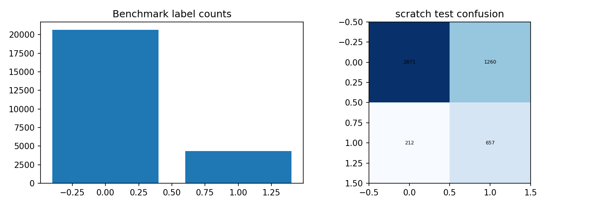

CDC minh họa dữ liệu bảng có các chỉ báo được định nghĩa trước. Bài gộp nhãn tiền tiểu đường và tiểu đường thành lớp dương, nên không gọi score này là xác suất chẩn đoán tiểu đường đơn thuần. Các nhóm predictor giống nhau không xuất hiện đồng thời ở train và test. Dataset không đại diện tự động cho một bệnh viện hoặc dân số khác. Phân bố benchmark phản ánh tập con đã chọn, không phải số bệnh nhân độc lập ngoài thực tế.


# 1.7. Dataset minh họa: MNIST

Nguồn: https://storage.googleapis.com/tensorflow/tf-keras-datasets/mnist.npz

| Dataset | Nguồn gốc | Train / Val / Test | Input |
| --- | --- | --- | --- |
| MNIST | 70,000 | 10000 / 2000 / 2000 | 16 × 16 × 1 |

| Mẫu | Input chuẩn hóa (tối đa 8 số đầu) | Target gốc |
| --- | --- | --- |
| 12000 | -0.49799999594688416, -0.49799999594688416, -0.49799999594688416, -0.49799999594688416, -0.49799999594688416, -0.49799999594688416, -0.49799999594688416, -0.49799999594688416 | 2.0000 |
| 12001 | -0.49799999594688416, -0.49799999594688416, -0.49799999594688416, -0.49799999594688416, -0.49799999594688416, -0.49799999594688416, -0.49799999594688416, -0.49799999594688416 | 3.0000 |
| 12002 | -0.49799999594688416, -0.49799999594688416, -0.49799999594688416, -0.49799999594688416, -0.49799999594688416, -0.49799999594688416, -0.49799999594688416, -0.49799999594688416 | 0.0000 |

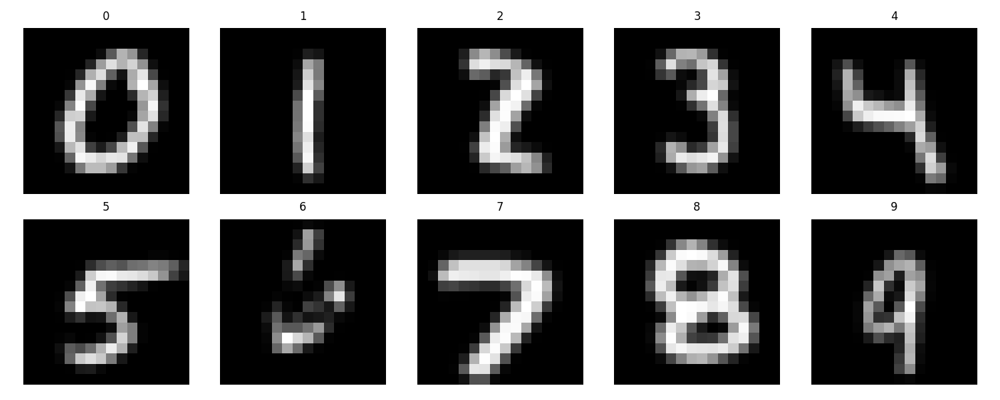

MNIST có nền và bố cục tương đối chuẩn hóa, thích hợp kiểm tra công thức CNN trên máy cá nhân. Ảnh tải từ điện thoại hoặc nhiều ký tự trên cùng một ảnh có phân bố khác. Hình minh họa gắn nhãn thật; các giá trị input trong bảng là phần đầu tensor chuẩn hóa, không phải code định danh lớp. Kết quả ở Chương 3 phải đọc cùng kích thước 16 × 16 và số ảnh benchmark đã nêu.


# 1.8. Dataset minh họa: AAPL

Nguồn: https://github.com/tuananhtrieu1305/ISD_Assignment01/tree/main/A06/datasets

| Dataset | Nguồn gốc | Train / Val / Test | Input |
| --- | --- | --- | --- |
| AAPL | 2,766 | 1880 / 403 / 404 | 30 × 8 |

| Mẫu | Input chuẩn hóa (tối đa 8 số đầu) | Target gốc |
| --- | --- | --- |
| 2283 | -0.6449999809265137, -0.4359999895095825, -0.6809999942779541, -0.4830000102519989, -0.6700000166893005, -1.0540000200271606, -0.38199999928474426, -2.0280001163482666 | -0.0076 |
| 2284 | 2.2239999771118164, 0.25200000405311584, 1.7330000400543213, 2.7669999599456787, 0.26899999380111694, -0.47699999809265137, -0.02800000086426735, -0.6079999804496765 | -0.0213 |
| 2285 | 0.41600000858306885, -0.38199999928474426, 0.2639999985694885, 0.8769999742507935, 0.44600000977516174, -0.3490000069141388, -0.03500000014901161, -0.3490000069141388 | 0.0165 |

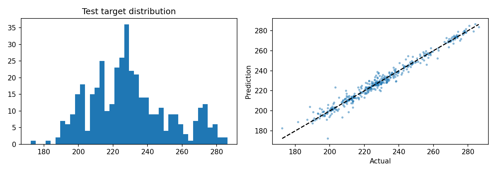

AAPL cho thấy việc giữ thứ tự thời gian quan trọng hơn xáo trộn ngẫu nhiên để tăng vẻ đồng nhất giữa các tập. Các hàng input là lịch sử, output là log-return phiên kế tiếp. Quan sát phân bố giá không đủ kết luận model có lợi thế dự báo. Bài học xuyên suốt lịch sử AI là điều chỉnh kỳ vọng theo dữ liệu và protocol kiểm chứng, thay vì chỉ nhìn tên của một kiến trúc mới.


# CHƯƠNG 2. ML CƠ BẢN - 2.1. Học có giám sát

Học có giám sát tìm một hàm f từ input x tới target y dựa trên các cặp đã quan sát. Classification trả lớp hoặc score từng lớp; regression trả một đại lượng liên tục. Trong bài, CDC là classification hai lớp và giá nhà là regression. Hai nhiệm vụ cần loss và metric khác nhau, dù có thể dùng cùng bộ khung MLP.

Tập train được dùng cập nhật tham số. Validation phục vụ chọn epoch hoặc cấu hình trong phạm vi đã định. Test mô phỏng dữ liệu chưa dùng cho hai bước trước. Nếu liên tục xem test rồi sửa model, test đã trở thành thông tin thiết kế và không còn vai trò độc lập ban đầu. Tiểu luận lưu checkpoint theo validation loss và ghi tiêu chí lựa chọn implementation trước bảng test.

Tính khái quát hóa phụ thuộc vào cách mẫu được hình thành. Các dòng giống nhau, cùng địa chỉ hoặc cùng khách hàng có thể liên hệ với nhau. Chia ngẫu nhiên từng dòng không luôn thích hợp. CDC dùng nhóm predictor, giá nhà dùng nhóm Address. Với chuỗi thời gian ở Chương 4, thứ tự nhãn được ưu tiên thay cho chia ngẫu nhiên.

Đánh giá ngoài mẫu không chỉ là chọn một hàm metric. Cần giải thích đơn vị output, định nghĩa lớp dương và phạm vi dữ liệu. Accuracy lớn có thể xuất hiện khi luôn đoán lớp phổ biến; RMSE lớn hoặc nhỏ cũng phải được đặt cạnh phân bố giá và baseline. Vì vậy, mỗi dataset có cả bảng metric và nhận xét về dữ liệu.

| Dataset | Nguồn gốc | Train / Val / Test | Input |
| --- | --- | --- | --- |
| CDC Diabetes | 253,680 | 16000 / 4000 / 5000 | 21 |
| Giá nhà Việt Nam | 30,229 | 19600 / 4665 / 5964 | 6 |


# 2.2. Các phương pháp tuyến tính và dựa trên khoảng cách

Hồi quy tuyến tính mô hình hóa y bằng xW+b. Khi cần hạn chế hệ số quá lớn, Ridge thêm hình phạt bình phương trọng số. Cách này tạo một baseline dễ kiểm tra, nhưng biểu diễn chỉ tuyến tính trong các đặc trưng đã cung cấp. Biến đổi log hoặc thêm biến tương tác có thể thay đổi miền hàm mà mô hình tuyến tính biểu diễn.

Logistic regression ánh xạ tổ hợp tuyến tính sang score nhị phân hoặc softmax đa lớp và tối ưu cross-entropy. Dù tên có chữ regression, ứng dụng thường gặp là phân loại. Ngưỡng chuyển score sang nhãn và class weight có ảnh hưởng tới Precision / Recall. Bài dùng LogisticRegression có class_weight balanced làm baseline cho CDC; điều này không đồng nghĩa score đã calibration.

K-nearest neighbors dự đoán theo các mẫu gần trong không gian đặc trưng. Khi các cột khác đơn vị, khoảng cách có thể bị một cột chi phối, nên chuẩn hóa và lựa chọn metric quan trọng. SVM tìm biên phân tách và có thể dùng kernel để biểu diễn phi tuyến. Hai phương pháp này được giới thiệu để đối chiếu nguyên lý, không tính vào các lần train được báo cáo.

Không nên chọn thuật toán chỉ vì nó phức tạp hơn. Một baseline có ít giả định, dễ debug giúp phát hiện lỗi xử lý hoặc đánh giá. Trong thực nghiệm giá nhà, target được biến đổi log 1 p và tất cả metric cuối được đổi về đơn vị gốc; nếu so một bảng loss log với một bảng RMSE tỷ đồng thì đó là hai đại lượng khác nhau.

| Phương pháp | Cơ chế | Điểm cần kiểm soát |
| --- | --- | --- |
| Linear/ Ridge | Ánh xạ tuyến tính | Thang đo, regularization, target transform |
| Logistic | Logit tuyến tính, cross-entropy | Lớp dương, weight, threshold |
| kNN | Láng giềng trong feature space | Khoảng cách và chuẩn hóa |
| SVM | Biên phân tách / kernel | C, kernel và chi phí dữ liệu lớn |


# 2.3. Cây, ensemble và mạng MLP

Decision tree chia không gian đặc trưng thành các vùng bằng điều kiện theo cột. Cây sâu có thể mô tả tương tác phức tạp nhưng dễ bám nhiễu. Random forest kết hợp nhiều cây được huấn luyện với ngẫu nhiên hóa để giảm phương sai so với một cây riêng lẻ. Boosting xây dựng mô hình theo chuỗi nhằm giảm phần lỗi còn lại. Các họ ensemble có khác biệt về tối ưu và rủi ro overfit; không gọi mọi ensemble là cùng một thuật toán.

MLP gồm các lớp affine xen activation. Nếu chỉ ghép lớp tuyến tính không có phi tuyến, toàn bộ mạng vẫn biểu diễn một ánh xạ tuyến tính. ReLU đưa điểm gãy vào hàm và làm gradient đơn giản ở các vị trí khác 0. Tiểu luận dùng một hidden layer 32 neuron để cân bằng khả năng biểu diễn và khả năng đối chiếu code.

Output của CDC có hai logits; softmax biến logits thành score tổng bằng 1. Output giá nhà là một số chuẩn hóa, không qua sigmoid. Loss classifier là weighted cross-entropy; loss regression là mean squared error. Scratch, Keras và PyTorch dùng cùng các công thức này thay vì lựa chọn mặc định khác nhau.

Baseline random forest trong bài có 100 cây và max_depth 12, seed 42. Đây là cấu hình cố định, chưa được tìm kiếm tối ưu. Bảng baseline được trình bày riêng với ba implementation MLP, vì một random forest không phải bản thay thế tương đương của cùng kiến trúc neural.

```python
hidden = relu(x @ W + b)          # (B, D) -> (B, 32)
logits = hidden @ V + c           # -> (B, 2) hoặc (B, 1)
loss = weighted_cross_entropy(logits, y)  # classification
# Regression: mean((logits[:, 0] - y_scaled)**2)
```


# 2.4. Dữ liệu và tiền xử lý: CDC Diabetes

Nguồn: https://www.kaggle.com/datasets/alexteboul/diabetes-health-indicators-dataset

| Dataset | Nguồn gốc | Train / Val / Test | Input |
| --- | --- | --- | --- |
| CDC Diabetes | 253,680 | 16000 / 4000 / 5000 | 21 |

| Mẫu | Input chuẩn hóa (tối đa 8 số đầu) | Target gốc |
| --- | --- | --- |
| 20000 | 1.097000002861023, 1.1349999904632568, 0.1979999989271164, -0.11100000143051147, 1.0700000524520874, -0.2150000035762787, -0.34200000762939453, -1.6419999599456787 | 0.0000 |
| 20001 | -0.9110000133514404, -0.8809999823570251, 0.1979999989271164, -1.1349999904632568, -0.9340000152587891, -0.2150000035762787, -0.34200000762939453, -1.6419999599456787 | 0.0000 |
| 20002 | 1.097000002861023, -0.8809999823570251, 0.1979999989271164, 0.6200000047683716, -0.9340000152587891, -0.2150000035762787, -0.34200000762939453, -1.6419999599456787 | 1.0000 |

Nguồn CDC có nhãn Diabetes_012 và 21 biến khảo sát. Nhãn 0 được giữ là không có tiểu đường; nhãn 1 và 2 được gộp thành nhóm tiền tiểu đường/tiểu đường. Đây là lựa chọn target của bài, không phải một nhãn lâm sàng mới. Các bản ghi trùng được loại trước khi nhóm các vector predictor giống nhau.

Sau group split, mỗi tập lấy một benchmark có giữ tỷ lệ nhãn: 16.000 train, 4.000 validation và 5.000 test. Việc lấy tập con được thực hiện độc lập bên trong từng split, vì vậy không đưa nhóm đã tách sang tập khác. Mean/std fit từ train; class weights bằng N/(K×count_k) trên train.

Các mã như Age, Education hoặc Income trong khảo sát là nhóm phân loại có thứ tự; không diễn giải trực tiếp Age =9 là chín tuổi. Bài dùng chúng ở dạng số theo nguồn để tạo baseline MLP, và ghi nhận giới hạn của việc xem khoảng cách giữa mã là đồng đều.

| Tập | Lớp 0 | Lớp 1 |
| --- | --- | --- |
| train | 13227 | 2773 |
| val | 3319 | 681 |
| test | 4131 | 869 |


# 2.5. Dữ liệu và tiền xử lý: Giá nhà Việt Nam

Nguồn: https://www.kaggle.com/datasets/nguyentiennhan/vietnam-housing-dataset-2024

| Dataset | Nguồn gốc | Train / Val / Test | Input |
| --- | --- | --- | --- |
| Giá nhà Việt Nam | 30,229 | 19600 / 4665 / 5964 | 6 |

| Mẫu | Input chuẩn hóa (tối đa 8 số đầu) | Target gốc |
| --- | --- | --- |
| 7 | 0.45500001311302185, 0.18199999630451202, 2.24399995803833, 1.1679999828338623, 0.5889999866485596, 1.3270000219345093 | 9.9000 |
| 16 | 3.2219998836517334, 4.059999942779541, 3.509000062942505, -0.14399999380111694, 1.875, -0.08699999749660492 | 9.4000 |
| 33 | 0.289000004529953, -0.16200000047683716, -0.04500000178813934, -0.14399999380111694, 0.5889999866485596, 1.8639999628067017 | 6.5000 |

File giá nhà có 30.229 dòng và 12 cột. Thực nghiệm giữ sáu predictor số: Area, Frontage, Access Road, Floors, Bedrooms, Bathrooms. Các giá trị thiếu được điền bằng median train, các giá trị âm ở predictor coi là thiếu. Chỉ giữ hàng Area và Price dương; không cắt bỏ ngoại lệ theo phân vị của toàn bộ dữ liệu.

Address được dùng làm khóa group split để những tin có cùng địa chỉ chính xác không nằm ở nhiều tập. Nó không được đưa vào predictor. Điều này giúp giảm một dạng leakage nhưng làm mạng thiếu thông tin vị trí quan trọng; cùng diện tích và số phòng có thể có giá khác nhau giữa các địa bàn.

Input dùng log 1 p rồi chuẩn hóa train. Target dùng log 1 p(Price), chuẩn hóa train và đổi ngược khi báo cáo tỷ VND. Biến đổi làm thay đổi trọng số tương đối của sai số khi tối ưu: giảm loss trong miền log không bảo đảm giảm mạnh lỗi tuyệt đối của nhà rất đắt. Chưa xác minh từng tin rao là một giao dịch đã hoàn tất.


# 2.6. Cài đặt MLP scratch và đạo hàm

```python
z = x @ p['w'] + p['b']
h = np.maximum(z, 0)
logits = h @ p['v'] + p['c']
# dz_out đã chứa hệ số trung bình batch và class weight.
grad_v = h.T @ dz_out
grad_c = dz_out.sum(axis=0)
grad_hidden = dz_out @ p['v'].T
grad_z = grad_hidden * (z > 0)
grad_w = x.T @ grad_z
grad_b = grad_z.sum(axis=0)
```

Cross-entropy được tính từ logits trừ max theo hàng trước khi lấy exp. Bước dịch này không đổi softmax nhưng giảm nguy cơ tràn số. Gradient logits bằng softmax trừ one-hot, nhân weight của nhãn thật và chia batch size. Loss weighted được lấy trung bình theo số mẫu, thống nhất với code hai framework; không chia thêm theo tổng weight.

Regression có gradient 2(pred- target )/B. Từ gradient output, quy tắc dây chuyền đi ngược qua head, ReLU và dense đầu. Bias gradient là tổng theo trục batch. Do hidden layer có kích thước nhỏ, toàn bộ phép tính có thể biểu diễn bằng NumPy, giúp đọc rõ từng tensor.

Trước cập nhật, norm chung được tính trên mọi gradient; nếu lớn hơn 1 thì cùng scale tất cả gradient. SGD cập nhật p←p− lr ×g với lr 0,02. Không có momentum hoặc Adam trong phép so sánh chính. Sự đơn giản của optimizer giúp giảm số khác biệt không cần thiết khi kiểm tra giữa framework.

Mã đầy đủ: src/scratch.py; notebook 02 chứa cả định nghĩa forward, objective, backward và step.


# 2.7. MLP Keras và PyTorch tương ứng

```python
# Keras: gán trọng số giống NumPy trước train.
inputs = tf.keras.layers.Input(shape=(features,))
h = tf.keras.layers.Dense(32, activation='relu')(inputs)
outputs = tf.keras.layers.Dense(n_outputs)(h)
model = tf.keras.Model(inputs, outputs)

# PyTorch: giữ cùng hướng ma trận (D, H).
def forward(self, x):
    p = self.params
    h = torch.relu(x @ p['w'] + p['b'])
    return h @ p['v'] + p['c']
```

PyTorch ParameterDict lưu các tensor có thể học theo đúng shape của NumPy. Những phép toán @, cộng bias và ReLU được autograd theo dõi. Keras dùng các layer Dense chuẩn, gán kernel và bias từ cùng bộ initialization. Cả hai mô hình nhận batch có cùng thứ tự mẫu và cùng dtype float 32 trong huấn luyện.

Vòng train Keras dùng GradientTape và SGD với global_ clipnorm 1. PyTorch gọi loss. backward, clip_grad_norm_ và optimizer.step. Scratch tự tính g. Sự khác biệt chính cần khảo sát là đường thực thi và độ chính xác số học, không phải độ rộng hoặc activation. Thời gian đo bao gồm overhead thực thi nên không đại diện một benchmark GPU tối ưu.

Với seed 42 và phép cập nhật gần như tương đương, ba metric có thể bằng nhau đến nhiều chữ số. Đây không phải bằng chứng số liệu được sao chép: mỗi implementation được train độc lập, có history và native checkpoint riêng. Bài lưu gradient checks và dự đoán test để người đọc có thể kiểm tra lại.

| Dataset / cài đặt | Tham số | Epoch tốt | Train giây |
| --- | --- | --- | --- |
| CDC Diabetes / scratch | 770 | 18 | 0.4625 |
| CDC Diabetes / keras | 770 | 18 | 2.2851 |
| CDC Diabetes / pytorch | 770 | 18 | 2.0878 |


# 2.8. Kết quả và baseline: CDC Diabetes

| Cài đặt | Accuracy | Macro-F1 | F1 | AP |
| --- | --- | --- | --- | --- |
| scratch | 0.7056 | 0.6338 | 0.4716 | 0.4432 |
| keras | 0.7056 | 0.6338 | 0.4716 | 0.4432 |
| pytorch | 0.7056 | 0.6338 | 0.4716 | 0.4432 |

Chọn trên validation bằng Macro-F1: scratch. Baseline đơn giản trên test: Accuracy =0.8262, Macro-F1 =0.4524.

| Baseline | Accuracy | Macro-F1 | F1 | AP |
| --- | --- | --- | --- | --- |
| LogisticRegression | 0.7146 | 0.6403 | 0.4767 | 0.4362 |
| RandomForest | 0.7890 | 0.6731 | 0.4785 | 0.4497 |

Accuracy và F1 được đọc cùng nhau vì lớp dương ít hơn. Class weighting tăng mức phạt lớp dương, có thể tăng Recall nhưng làm Precision giảm. Vì vậy, không chọn winner bằng Accuracy duy nhất hoặc đổi threshold sau khi xem test. Tiểu luận dùng argmax hai logits, tương đương ngưỡng 0,5 của softmax lớp dương.

Baseline LogisticRegression và RandomForest có cơ chế biểu diễn khác MLP. Nếu một baseline tốt hơn ở metric cụ thể, phải ghi nhận kết quả đó thay vì suy luận mô hình neural mặc định vượt trội. Các cấu hình chưa qua tìm kiếm nên kết luận chỉ nằm trong phạm vi đã chạy.


# 2.9. Kết quả và baseline: Giá nhà Việt Nam

| Cài đặt | RMSE | MAE | R² |
| --- | --- | --- | --- |
| scratch | 1.8760 | 1.4980 | 0.2799 |
| keras | 1.8760 | 1.4980 | 0.2799 |
| pytorch | 1.8760 | 1.4980 | 0.2799 |

Chọn trên validation bằng RMSE: keras. Baseline đơn giản trên test: RMSE=2.2138, MAE=1.8356, R²=-0.0028.

| Baseline | RMSE | MAE | R² |
| --- | --- | --- | --- |
| Ridge | 1.9465 | 1.5550 | 0.2247 |
| RandomForest | 1.8542 | 1.4719 | 0.2965 |

RMSE nhạy với sai số lớn còn MAE thể hiện lỗi tuyệt đối trung bình. R² được tính trong đơn vị giá gốc, không phải trên target chuẩn hóa. Cần so với baseline dự đoán mean train và hai mô hình cổ điển. Một MLP trên sáu cột số chưa nắm được vị trí, tình trạng pháp lý và nhiều yếu tố của bất động sản.

Các dự đoán là ước lượng từ dữ liệu rao bán của nguồn, không phải định giá bảo đảm. Chênh lệch rất nhỏ giữa ba implementation không có ý nghĩa thực tiễn lớn so với độ thiếu thông tin của predictor. Để cải thiện cần đánh giá thêm feature và protocol, không chỉ đổi framework.


# 2.10. Learning curve của hai bài ML

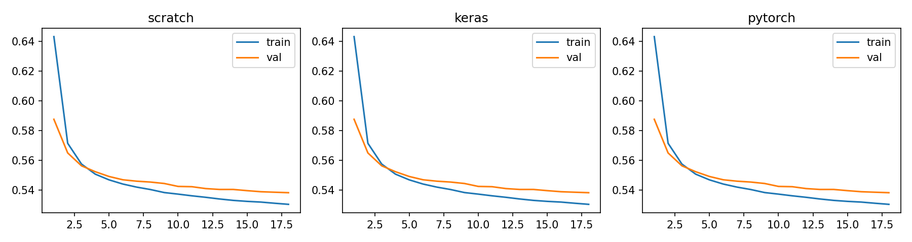

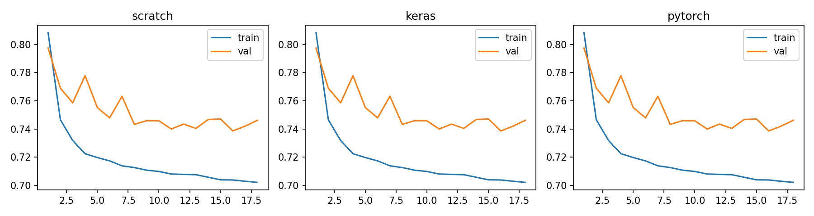

Mỗi đường biểu diễn loss theo epoch; train loss được tích lũy trong lúc batch cập nhật, còn validation loss tính từ model cuối epoch. Mức loss của classification và regression không có cùng ý nghĩa hay đơn vị, nên không so cao thấp giữa hai hình. Epoch tốt được chọn riêng cho từng implementation bằng validation loss nhỏ nhất.

Đường học gần nhau hỗ trợ tính nhất quán của code. Tuy nhiên, sự trùng khớp không chứng minh dữ liệu có đủ thông tin hoặc việc chia tập hoàn hảo. Kiểm tra thuật toán và đánh giá tính đại diện dữ liệu là hai lớp kiểm chứng khác nhau. Một triển khai đúng có thể vẫn dự đoán yếu.


# 2.11. Phân bố, ví dụ sai và chi phí


| Chỉ số | Thực | Dự đoán | Sai số / score |
| --- | --- | --- | --- |
| 729 | 9.9500 | 3.1287 | 6.8213 |
| 6824 | 10.0000 | 3.7899 | 6.2101 |
| 16227 | 9.8000 | 3.7044 | 6.0956 |
| 6188 | 9.8000 | 3.7614 | 6.0386 |
| 20425 | 10.0000 | 4.0924 | 5.9076 |
| 9578 | 1.2000 | 7.1059 | 5.9059 |

Với CDC, confusion matrix có hàng là lớp thật và cột là lớp dự đoán. Với giá nhà, bảng liệt kê các sai số lớn nhất của implementation đã chọn; không dùng những ví dụ này để chọn lại model. Dữ liệu chuẩn hóa trong bảng input mẫu phục vụ tái lập, còn metric regression được đổi ngược về tỷ VND.

Các hàng giá nhà sai lớn gợi ý nhu cầu bổ sung vị trí hoặc phân tích phân khúc giá, nhưng chưa xác định nguyên nhân cho từng căn nhà. Những nhận xét đó là giả thuyết cho nghiên cứu sau, không phải thông tin đã có trong dữ liệu thực nghiệm.

| Dataset / cài đặt | Tham số | Epoch tốt | Train giây |
| --- | --- | --- | --- |
| Giá nhà Việt Nam / scratch | 257 | 16 | 0.5001 |
| Giá nhà Việt Nam / keras | 257 | 16 | 2.2980 |
| Giá nhà Việt Nam / pytorch | 257 | 16 | 2.6011 |


# 2.12. Tiểu kết và giới hạn ML

Chương 2 đã trình bày các nguyên lý ML nền tảng, chuẩn bị hai dataset và huấn luyện ba implementation MLP độc lập trên mỗi dataset. Các baseline tuyến tính và random forest bổ sung góc nhìn ngoài neural network. Bản scratch thực hiện thật cả đạo hàm và cập nhật, được kiểm tra trước khi chạy dữ liệu.

Nhóm thực nghiệm này cho thấy việc thống nhất loss reduction, shape và initialization có vai trò lớn khi đối chiếu framework. Khi các điều kiện đó trùng nhau, lựa chọn NumPy, Keras hoặc PyTorch không tự làm thay đổi bài toán thống kê. Framework giúp tổ chức và tối ưu tính toán, còn giá trị dự báo phụ thuộc thông tin đầu vào và protocol.

CDC có nhãn gộp và dữ liệu khảo sát; không được diễn giải thành một công cụ chẩn đoán. Giá nhà dùng sáu predictor số và thiếu vị trí; không đại diện một hệ thống định giá đầy đủ. Group split giảm một số dạng trùng lặp nhưng không bảo đảm tổng quát hóa sang bệnh viện mới, thị trường mới hoặc thời kỳ khác.

Hướng mở rộng hợp lý gồm đánh giá nhiều seed, thêm validation folds ở cấp nhóm, khảo sát đặc trưng và calibration cho classifier. Những bước này cần được thực hiện với test mới hoặc giữ test hiện tại khóa kín. Trong bài hiện tại không có tìm siêu tham số hay lựa chọn threshold bằng test; các giới hạn được giữ để kết luận trung thực.

| Đã thực hiện | Chưa thực hiện |
| --- | --- |
| Scratch/ Keras / PyTorch cùng MLP | Đánh giá nhiều seed và khoảng tin cậy |
| Hai dataset có split rõ | Đánh giá chuyển miền ngoài nguồn dữ liệu |
| Baseline và phân tích lỗi | Calibration hoặc triển khai ra quyết định thực |
| Checkpoint và web | Bảo đảm chất lượng cho mọi đầu vào mới |


# CHƯƠNG 3. CNN - 3.1. Động cơ và cấu trúc ảnh

Ảnh có cấu trúc lân cận theo hai trục không gian. Nếu trải tất cả pixel thành vector và nối đầy đủ ngay từ đầu, mô hình không được cung cấp trực tiếp giả định rằng các vùng cục bộ có thể chia sẻ kiểu đặc trưng. CNN dùng kernel trên các vị trí để khai thác giả định này, giảm số tham số ở lớp trích đặc trưng so với dense toàn ảnh.

Một kernel nhỏ có thể phản ứng với tương phản hoặc cấu trúc màu đơn giản. Qua nhiều lớp, receptive field tăng và biểu diễn có thể kết hợp vùng lớn hơn. Tuy nhiên, không cần gán mọi kernel học được cho một khái niệm như “mắt” hoặc “cây” nếu chưa phân tích. Tiểu luận dùng một lớp conv để đối chiếu có kiểm soát, không khẳng định mạng học được cấu trúc ngữ nghĩa sâu.

Phép convolution trong các framework thường là cross-correlation: kernel không bị lật như định nghĩa convolution toán học cổ điển. Mã scratch dùng cùng quy ước để so gradient đúng. Translation equivariance của phép tích chập cũng khác với invariance của toàn bộ classifier; pooling, biên ảnh và head có thể thay đổi tính chất này.

Hai dataset được chọn là MNIST và EuroSAT. MNIST có mẫu chữ số đơn giản hơn về bối cảnh; EuroSAT có màu và texture của bề mặt đất. Cùng một CNN nhỏ giúp quan sát tác động của dữ liệu khi giữ kiến trúc cố định, thay vì so hai mạng có quy mô hoàn toàn khác nhau.

| Dataset | Nguồn gốc | Train / Val / Test | Input |
| --- | --- | --- | --- |
| MNIST | 70,000 | 10000 / 2000 / 2000 | 16 × 16 × 1 |
| EuroSAT | 27,000 | 6400 / 1600 / 2000 | 16 × 16 × 3 |


# 3.2. Convolution, pooling và số tham số

```python
# Input NHWC: (B, 16, 16, C)
# Kernel: (3, 3, C, 8), stride1, valid
# Conv output: (B, 14, 14, 8)
# ReLU: giữ nguyên shape
# AveragePool2: (B, 7, 7, 8)
# Flatten: (B, 392)
# Dense: (B, 10)
```

Convolution tại mỗi vị trí là tổng tích giữa patch và kernel, cộng bias theo kênh output. Với padding valid và stride 1, chiều không gian giảm từ 16 xuống 14. ReLU giữ phần dương và không đổi shape. Average pooling 2 × 2 lấy trung bình bốn giá trị không chồng lấp, đưa shape về 7 × 7. Head dense nhận 392 giá trị và trả 10 logits.

Kernel có 3 × 3 ×C× 8 trọng số cùng 8 bias. Head có 392 × 10 trọng số cùng 10 bias. Do đó, MNIST và EuroSAT khác số tham số convolution vì số kênh 1 và 3; head giống nhau. Số pixel của feature map không phải số tham số học được: cùng một kernel được dùng tại mọi vị trí.

Tiểu luận chọn average pooling để đạo hàm đơn giản và rõ: gradient từ một ô pooled được chia đều bốn ô input. Max pooling cần lưu vị trí argmax; nó có thể dùng trong mạng khác nhưng không phải phép toán đang chạy ở đây. Việc đổi pooling mà không đổi tên cấu hình sẽ làm hỏng tính công bằng của phép so sánh.

| Layer | Tham số MNIST | Tham số EuroSAT |
| --- | --- | --- |
| Conv 3 × 3, 8 filters | 80 | 224 |
| Dense 392→10 | 3930 | 3930 |
| Tổng | 4010 | 4154 |


# 3.3. Loss và lan truyền ngược qua CNN

Classifier nhận logits từ head, sử dụng weighted softmax cross-entropy. Gradient head có dạng giống MLP. Sau khi nhân với ma trận head chuyển vị, gradient được reshape về feature map pooled. Mỗi phần tử được phân phối đều cho bốn vị trí trước average pooling; sau đó nhân mặt nạ ReLU của pre-activation conv.

Gradient kernel được tính bằng tổng outer product giữa patch đầu vào và gradient tại output tương ứng. Việc kernel được dùng ở nhiều vị trí khiến gradient cần cộng trên cả batch và hai trục không gian. Bias gradient là tổng output gradient theo cùng ba trục. Trong kiến trúc một conv này không cần dùng gradient ảnh input để cập nhật một layer trước nó.

Mã NumPy dùng sliding_window_view để biểu diễn patch mà không viết một vòng lặp Python riêng cho từng pixel. Tensordot thực hiện phép co các trục tương ứng. Đây là một cách tăng hiệu quả tính toán, nhưng vẫn là code forward / backward tự triển khai và không gọi autograd. Quy tắc đạo hàm không đổi khi thay vòng lặp bằng phép tensor.

```python
dpool = dflat.reshape(B, 7, 7, 8)
dconv = np.repeat(np.repeat(dpool, 2, axis=1), 2, axis=2) / 4
dconv *= (preactivation > 0)
dW = np.tensordot(patches, dconv,
                 axes=([0, 1, 2], [0, 1, 2]))
db = dconv.sum(axis=(0, 1, 2))
```

Finite differences kiểm tra một số phần tử của từng tensor parameter; gradient đầy đủ được so với hai autograd trên mini- batch nhỏ. Các kiểm tra không dùng test dataset để tối ưu mô hình.


# 3.4. Dataset ảnh: MNIST

Nguồn: https://storage.googleapis.com/tensorflow/tf-keras-datasets/mnist.npz

| Dataset | Nguồn gốc | Train / Val / Test | Input |
| --- | --- | --- | --- |
| MNIST | 70,000 | 10000 / 2000 / 2000 | 16 × 16 × 1 |


Nguồn MNIST có 60.000 ảnh train và 10.000 ảnh test. Bài chọn 10.000 train cùng 2.000 validation từ phần train chính thức, và 2.000 test từ phần test chính thức, giữ tỷ lệ lớp bằng stratified sampling. Ảnh gốc 28 × 28 grayscale được resize về 16 × 16. Quy mô toàn nguồn và benchmark được phân biệt trong bảng.

Pixel được chia 255 rồi chuẩn hóa bằng mean/std channel trên train. Việc thu nhỏ giúp scratch train nhanh nhưng có thể làm mất nét mảnh. Kết quả không so trực tiếp với mô hình trên full MNIST 28 × 28 hoặc có augmentation. Ảnh nhập web cần gần dạng chữ số sáng trên nền tối; nhiều ký tự cùng ảnh nằm ngoài task.


# 3.5. Dataset ảnh: EuroSAT

Nguồn: https://zenodo.org/records/7711810

| Dataset | Nguồn gốc | Train / Val / Test | Input |
| --- | --- | --- | --- |
| EuroSAT | 27,000 | 6400 / 1600 / 2000 | 16 × 16 × 3 |

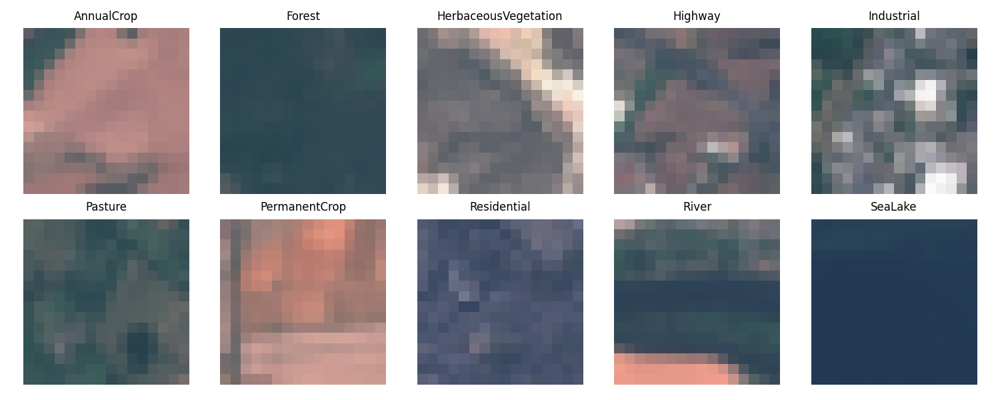

EuroSAT RGB có 27.000 ảnh vệ tinh và 10 lớp sử dụng/phủ đất. Benchmark chọn 10.000 ảnh phân tầng theo nhãn rồi chia 6.400 train,1.600 validation,2.000 test. Các ảnh 64 × 64 RGB được resize 16 × 16 trước chuẩn hóa channel. Tiểu luận chỉ sử dụng ba kênh RGB, không nhận là dùng toàn bộ các dải phổ vệ tinh.

Các nhãn có thể tương đồng về texture và màu ở độ phân giải nhỏ. Random stratified split không kiểm soát riêng vị trí địa lý và khả năng các vùng gần nhau có liên quan. Vì vậy, metric trong bài là kết quả trong benchmark này, chưa chứng minh transfer sang vùng địa lý hoặc mùa quan sát khác.


# 3.6. CNN scratch: forward và cập nhật

```python
patch = np.lib.stride_tricks.sliding_window_view(
    x, (3, 3), axis=(1, 2))
patch = patch.transpose(0, 1, 2, 4, 5, 3)
z = np.tensordot(patch, W, axes=([3,4,5], [0,1,2])) + b
a = np.maximum(z, 0)
h = a.reshape(B, 7, 2, 7, 2, 8).mean((2,4)).reshape(B, -1)
logits = h @ V + c
loss, dlogits = objective(logits, y, 'classification', weight)
grads = backward(parameters, cache, dlogits, 'cnn')
step(parameters, grads, lr=0.04, clip=1.0)
```

Shape patch là (B,14,14,3,3,C). Phép tensordot co ba trục kernel để thu output NHWC. Bộ cache giữ patch, pre-activation và feature head cho backward. Trong cài đặt thực tế B được lấy từ len(x), nên batch cuối nhỏ hơn 128 vẫn tính đúng trung bình loss.

Quá trình train chạy 20 epoch bằng SGD lr 0,04, cùng thứ tự mẫu cho ba implementation. Mỗi epoch đánh giá validation loss và giữ trọng số tốt nhất. Không augmentation hoặc dropout được thêm riêng cho framework. Tất cả đều train từ đầu từ cùng initialization.

Giảm ảnh xuống 16 × 16 và giữ một conv là lựa chọn phục vụ yêu cầu scratch đầy đủ trên CPU. Nó làm giới hạn kiến trúc dễ giải thích nhưng cũng giới hạn khả năng học. Báo cáo không che giấu đánh đổi này bằng cách dùng checkpoint của một mạng lớn hơn cho web hoặc lấy metric từ bài khác.


# 3.7. CNN Keras và PyTorch

```python
# Keras, NHWC
h = Conv2D(8, 3, activation='relu')(inputs)
h = AveragePooling2D(2)(h)
h = Flatten()(h)
outputs = Dense(10)(h)

# PyTorch: conv nhận NCHW, flatten phải về NHWC.
a = F.conv2d(x.permute(0,3,1,2),
             W.permute(3,2,0,1), bias=b)
a = F.avg_pool2d(torch.relu(a), 2)
h = a.permute(0,2,3,1).reshape(len(x), -1)
logits = h @ V + c
```

Khác biệt layout là một nguồn lỗi phổ biến. Nếu PyTorch flatten trực tiếp NCHW nhưng gán head theo thứ tự NHWC của NumPy / Keras, các phần tử feature sẽ nối vào sai trọng số dù shape cuối đều là 392. Bài đổi lại layout trước flatten để bảo đảm cùng ánh xạ.

Các kernel được chuyển từ shape 3 × 3 ×C× 8 sang 8 ×C× 3 × 3 khi gọi convolution PyTorch. Đây là đổi cách lưu tensor, không phải đổi dữ liệu huấn luyện. Kiểm tra forward và gradient trước train giúp phát hiện nhanh nhầm thứ tự trục. Các checkpoint native được lưu sau khi gán lại trọng số epoch tốt nhất.

Cả ba implementation giữ softmax ở bước tính loss hoặc đánh giá; head không thêm softmax trước hàm cross-entropy nhận logits. Nguyên tắc này giúp tránh nhân đôi biến đổi hoặc gây mất ổn định số học. Bản web chỉ gọi softmax để hiển thị score của các lớp.


# 3.8. Đánh giá CNN trên MNIST

| Cài đặt | Accuracy | Macro-F1 |
| --- | --- | --- |
| scratch | 0.9405 | 0.9400 |
| keras | 0.9405 | 0.9400 |
| pytorch | 0.9405 | 0.9400 |

Chọn trên validation bằng Macro-F1: scratch. Baseline đơn giản trên test: Accuracy =0.1135, Macro-F1 =0.0204.

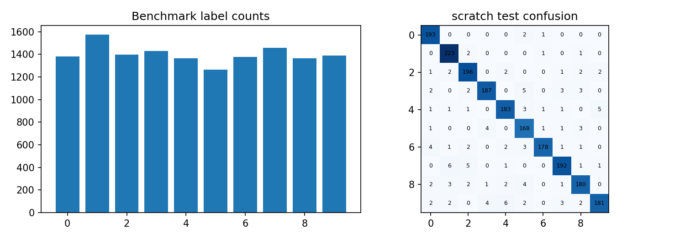

Macro-F1 lấy trung bình đều F1 các lớp, giúp tránh chỉ nhìn lớp có nhiều mẫu. Baseline dự đoán lớp phổ biến sử dụng thống kê train. Confusion matrix dùng số đếm; các ô hàng thật/cột dự đoán cho thấy hướng nhầm. Hình và bảng được tạo từ cùng prediction đã lưu, không dựng số liệu minh họa.

Các khác biệt rất nhỏ giữa framework có thể do làm tròn và thứ tự phép toán, đặc biệt khi score hai lớp gần nhau. Với chỉ một seed, không đủ cơ sở gọi khác biệt này là ưu thế ổn định. Cần tập trung vào mức chất lượng so với baseline và loại nhầm mà kiến trúc nhỏ còn gặp.


# 3.9. Đánh giá CNN trên EuroSAT

| Cài đặt | Accuracy | Macro-F1 |
| --- | --- | --- |
| scratch | 0.6055 | 0.5963 |
| keras | 0.6055 | 0.5963 |
| pytorch | 0.6055 | 0.5963 |

Chọn trên validation bằng Macro-F1: scratch. Baseline đơn giản trên test: Accuracy =0.1110, Macro-F1 =0.0200.

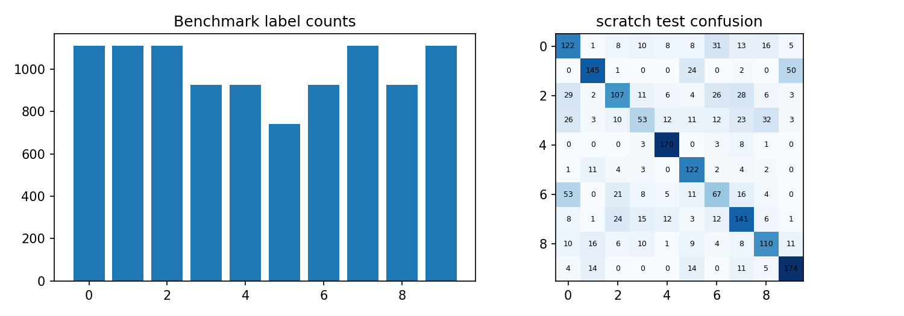

Macro-F1 lấy trung bình đều F1 các lớp, giúp tránh chỉ nhìn lớp có nhiều mẫu. Baseline dự đoán lớp phổ biến sử dụng thống kê train. Confusion matrix dùng số đếm; các ô hàng thật/cột dự đoán cho thấy hướng nhầm. Hình và bảng được tạo từ cùng prediction đã lưu, không dựng số liệu minh họa.

Các khác biệt rất nhỏ giữa framework có thể do làm tròn và thứ tự phép toán, đặc biệt khi score hai lớp gần nhau. Với chỉ một seed, không đủ cơ sở gọi khác biệt này là ưu thế ổn định. Cần tập trung vào mức chất lượng so với baseline và loại nhầm mà kiến trúc nhỏ còn gặp.


# 3.10. Đường học và chi phí CNN

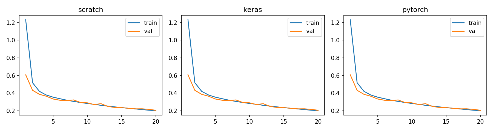

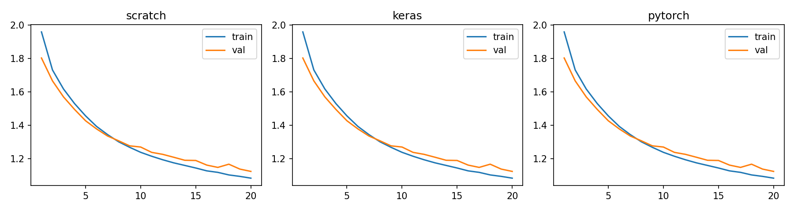

| Dataset / cài đặt | Tham số | Epoch tốt | Train giây |
| --- | --- | --- | --- |
| MNIST / scratch | 4010 | 20 | 9.8716 |
| MNIST / keras | 4010 | 20 | 5.0716 |
| MNIST / pytorch | 4010 | 20 | 5.6658 |
| EuroSAT / scratch | 4154 | 20 | 10.3540 |
| EuroSAT / keras | 4154 | 20 | 4.0626 |
| EuroSAT / pytorch | 4154 | 20 | 4.6414 |

Thời gian bao gồm vòng train và validation trên CPU với các cấu hình hiện tại. NumPy và framework có overhead khác nhau; không suy ra tốc độ GPU hoặc tốc độ model lớn từ bảng này. Số tham số cho biết quy mô trọng số nhưng không phản ánh đầy đủ số phép tính.


# 3.11. Phân tích trường hợp sai

| Chỉ số | Thực | Dự đoán | Sai số / score |
| --- | --- | --- | --- |
| 12150 | 8.0000 | 0.0000 | 0.7883 |
| 12154 | 0.0000 | 5.0000 | 0.8620 |
| 12165 | 9.0000 | 1.0000 | 0.4726 |
| 12170 | 9.0000 | 5.0000 | 0.3359 |
| 12173 | 4.0000 | 9.0000 | 0.3602 |
| 12178 | 3.0000 | 8.0000 | 0.8629 |

| Chỉ số | Thực | Dự đoán | Sai số / score |
| --- | --- | --- | --- |
| 8001 | 3.0000 | 7.0000 | 0.4428 |
| 8004 | 0.0000 | 7.0000 | 0.5285 |
| 8007 | 3.0000 | 6.0000 | 0.3281 |
| 8008 | 2.0000 | 6.0000 | 0.2306 |
| 8010 | 3.0000 | 0.0000 | 0.6628 |
| 8011 | 3.0000 | 6.0000 | 0.3806 |

Bảng đầu liệt kê các mẫu MNIST sai; bảng sau là EuroSAT. Chỉ số mẫu tham chiếu cache benchmark; nhãn số ánh xạ theo danh sách classes trong summary.json. Score là softmax lớn nhất của dự đoán sai, không phải thước đo mức độ đúng. Một dự đoán sai có score cao cho thấy score chưa bảo đảm độ tin cậy.

MNIST có thể mất thông tin nét sau resize và gặp các chữ số có hình dạng gần nhau. EuroSAT đòi hỏi biểu diễn texture/màu và bối cảnh; ảnh 16 × 16 khó giữ chi tiết. Đây là các giả thuyết phù hợp với task, nhưng chưa được kiểm định bằng ablation độ phân giải trong bài hiện tại.

Các ví dụ lỗi được chọn sau khi cố định model. Không sửa kiến trúc để giảm lỗi trên chính những mẫu này rồi tiếp tục gọi chúng là test. Nếu muốn nghiên cứu sâu hơn, cần tách một bộ phân tích lỗi khỏi bộ đánh giá cuối hoặc dùng một test mới.


# 3.12. Tiểu kết CNN và hướng mở rộng

Chương 3 đã triển khai trọn vẹn một CNN nhỏ bằng NumPy scratch, Keras và PyTorch, huấn luyện trên hai tập ảnh có khác biệt về cấu trúc. Bản scratch có backward qua head, average pooling, ReLU và convolution kernel. Sai phân hữu hạn và gradient autograd xác nhận các phép biến đổi này trên mini- batch kiểm tra.

So sánh cùng kiến trúc giúp tách câu hỏi “ code có nhất quán không” khỏi câu hỏi “kiến trúc có đủ tốt không”. Khi giữ mọi điều kiện tương ứng, ba đường học và metric thường rất gần. Chất lượng thực tế còn chịu ảnh hưởng của độ phân giải, lượng dữ liệu, cấu trúc mạng và đặc trưng của nhãn.

Các hướng mở rộng như thêm convolution, augmentation, batch normalization hoặc transfer learning có thể được nghiên cứu ở protocol riêng. Nếu thêm chỉ cho một implementation thì không còn là phép đối chiếu framework hiện tại. Cần ghi lại cả chi phí và metric, thay vì tăng kiến trúc rồi chỉ báo cáo một chỉ số tốt nhất.

Web phục vụ đúng model 16 × 16 của bài, có hiển thị mẫu input để người đọc thấy phạm vi. Ảnh người dùng khác domain, bị xoay mạnh hoặc chứa nhiều đối tượng không được bảo đảm phù hợp. Mô hình EuroSAT không phân đoạn vị trí trên ảnh; nó chỉ gán một trong mười lớp cho toàn ảnh đầu vào.

| Hạng mục | Kết luận phạm vi |
| --- | --- |
| Scratch | Đã có forward, backward và SGD thật |
| Benchmark | Tập con cố định, ảnh 16 × 16 |
| Framework | Cùng initialization và kiến trúc |
| Hạn chế | Một seed; chưa spatial split /augmentation/transfer |


# CHƯƠNG 4. RNN - 4.1. Chuỗi và trạng thái

Dữ liệu tuần tự gồm các quan sát có thứ tự. Một cửa sổ X cóT bước, mỗi bướcD đặc trưng; batch có shape(B,T,D). RNN cập nhật trạng thái h_t từ input x_t và trạng thái trước. Cùng trọng số được dùng ở mọi bước, tạo một hàm có cấu trúc phù hợp khi muốn tích lũy thông tin quá khứ.

Trong mô hình many-to-one của bài, chỉ trạng thái cuối được đưa vào head để tạo một target. Với AAPL, target là log-return phiên kế tiếp; với khách hàng, target là có mua trong tuần ngay sau cửa sổ. Mỗi cửa sổ khởi tạo h 0 bằng 0, không mang trạng thái của khách hoặc cửa sổ khác qua batch.

RNN không tự bảo đảm hiểu quan hệ thời gian. Nếu input có ngày đích, hoặc scaler fit cả tương lai, model có thể nhận thông tin không tồn tại ở lúc dự đoán. Vì vậy, việc xác định thời điểm nhãn có thể biết và các bước lịch sử được phép dùng quan trọng hơn chỉ lựa chọn một recurrent layer.

Tiểu luận chọn Vanilla RNN để bản scratch BPTT có thể đọc đầy đủ và đối chiếu trực tiếp. Những cải tiến như LSTM/GRU được trình bày ở lý thuyết, nhưng không cộng vào 18 mô hình chính đã train. Các kết quả RNN A 06 trước đó không được thay vào bảng hiện tại vì optimizer và protocol đối chiếu đã thay đổi.

| Dataset | Nguồn gốc | Train / Val / Test | Input |
| --- | --- | --- | --- |
| AAPL | 2,766 | 1880 / 403 / 404 | 30 × 8 |
| Online Retail II | 1,067,371 | 25937 / 5932 / 7484 | 8 × 6 |


# 4.2. Vanilla RNN và hợp hàm theo thời gian

```python
h = np.zeros((batch_size, 16))
states = [h]
for t in range(sequence_length):
    h = np.tanh(x[:, t] @ W + h @ U + b)
    states.append(h)
logits = h @ V + c
```

Tại bước t, h_t=tanh(x_tW+h_{t-1}U+b). Nếu gọi f_t là hàm cập nhật với input x_t đã cố định, trạng thái cuối là hợp f_T∘...∘f_1 tác động lênh 0. Tham sốW,U,b được chia sẻ, còn các giá trịx_t khác nhau. Cách biểu diễn này liên hệ trực tiếp với yêu cầu giải thích hàm và hợp hàm của học phần.

Ma trậnW có shapeD× 16, U có 16 × 16, b có 16 phần tử. HeadV có 16 ×C và biasc cóC phần tử. Với regression C=1; classification hai lớpC=2. Số tham số không tăng theoT, dù số phép tính và bộ nhớ lưu trạng thái trong backward tăng theo chiều dài chuỗi.

Trong bài, PyTorch hiện thực recurrence bằng phép tensor với ParameterDict thay vì nn. RNN mặc định có hai bias. Keras Simple RNN và scratch đều dùng một bias. Lựa chọn này làm số tham số và quy tắc tối ưu trùng nhau, tránh một nguồn khác biệt đã gặp khi chuyển giữa thư viện.

| Dataset | D | T | Output | Tham số |
| --- | --- | --- | --- | --- |
| AAPL | 8 | 30 | 1 | 417 |
| Khách hàng | 6 | 8 | 2 | 402 |


# 4.3. BPTT và kiểm soát gradient

```python
dh = dlogits @ V.T
dW = np.zeros_like(W); dU = np.zeros_like(U)
db = np.zeros_like(b)
for t in range(T-1, -1, -1):
    dz = dh * (1 - states[t+1]**2)
    dW += x[:, t].T @ dz
    dU += states[t].T @ dz
    db += dz.sum(axis=0)
    dh = dz @ U.T
```

Backward đi từ bước cuối về đầu. Đạo hàm tanh bằng 1−h²; gradientW vàU nhận tổng đóng góp từ mọi thời điểm vì cùng trọng số được dùng lặp lại. Gradient đi tới trạng thái trước bằng phép nhânU chuyển vị. Các chỉ số states[t] và states[t+1] phải khớp h trước/sau cập nhật; sai một chỉ số có thể vẫn cho shape hợp lệ nhưng đạo hàm sai.

Tích nhiều Jacobian có thể co nhỏ hoặc tăng mạnh. Gradient clipping global norm 1 hạn chế bùng nổ bằng cách scale đồng thời toàn bộ gradient; nó không tự giải quyết mọi phụ thuộc dài hạn. Độ dài cửa sổ, initialization và độ bão hòa tanh đều ảnh hưởng việc truyền tín hiệu.

Scratch trong bài không gọi autograd. Hai framework tự động đạo hàm cùng recurrence. Check gradient dùng chuỗi ngắn và float 64 cho finite differences, còn train dùng float 32. Sai số nhỏ trong kiểm tra cho thấy việc cài đạo hàm nhất quán trên ví dụ kiểm tra; không đồng nghĩa đã chứng minh đúng cho mọi trường hợp số học hoặc dữ liệu bất thường.


# 4.4. LSTM, GRU và phạm vi mô hình

LSTM bổ sung cell state và các cổng input, forget, output. Cell được cập nhật bằng đường cộng của thông tin được giữ và thông tin mới, giúp tạo một đường truyền khác với recurrence tanh đơn giản. Các gate có giá trị liên tục, không phải nhãn 0/1 cứng. Cơ chế này nhằm cải thiện học phụ thuộc dài nhưng không loại bỏ mọi vấn đề dữ liệu và tối ưu [5].

GRU kết hợp reset và update gate, không có cell state riêng. Các thư viện có biến thể reset-before hoặc reset-after; việc chuyển trọng số cần thống nhất công thức và thứ tự gate. Bi RNN /BiLSTM đọc hai chiều của một cửa sổ; nếu cửa sổ hoàn toàn là quá khứ thì đọc ngược không tự tạo leakage, nhưng đưa thời điểm đích vào cửa sổ vẫn là sai.

Attention cho phép truy cập các vị trí khác qua trọng số phụ thuộc nội dung thay vì chỉ qua trạng thái cuối. Tuy nhiên, nghiên cứu thêm kiến trúc này cần một hợp đồng so sánh khác về số tham số, compute và dữ liệu. Tiểu luận chỉ trình bày để đặt Vanilla RNN vào bối cảnh phát triển, không ghi nhận đã train LSTM/GRU/Transformer trong bảng của chương này.

Một mô hình đơn giản nhưng có protocol rõ tạo điểm khởi đầu có thể kiểm tra. Khi baseline quá mạnh hoặc predictor ít thông tin, tăng độ phức tạp chưa chắc đem lại cải thiện. Các thí nghiệm sau cần chứng minh lợi ích trên dữ liệu ngoài mẫu thay vì dựa vào trực giác rằng nhiều gate sẽ luôn tốt hơn.

| Kiến trúc | Trạng thái | Vai trò trong tiểu luận |
| --- | --- | --- |
| Vanilla RNN | Hidden tanh | Train bằng cả ba cách |
| LSTM | Hidden + cell + gates | Lý thuyết mở rộng |
| GRU | Hidden + reset/update | Lý thuyết mở rộng |
| Attention | Kết hợp vị trí có trọng số | Bối cảnh lịch sử |


# 4.5. Dataset chuỗi: AAPL

Nguồn: https://github.com/tuananhtrieu1305/ISD_Assignment01/tree/main/A06/datasets

| Dataset | Nguồn gốc | Train / Val / Test | Input |
| --- | --- | --- | --- |
| AAPL | 2,766 | 1880 / 403 / 404 | 30 × 8 |

| Mẫu | Input chuẩn hóa (tối đa 8 số đầu) | Target gốc |
| --- | --- | --- |
| 2283 | -0.6449999809265137, -0.4359999895095825, -0.6809999942779541, -0.4830000102519989, -0.6700000166893005, -1.0540000200271606, -0.38199999928474426, -2.0280001163482666 | -0.0076 |
| 2284 | 2.2239999771118164, 0.25200000405311584, 1.7330000400543213, 2.7669999599456787, 0.26899999380111694, -0.47699999809265137, -0.02800000086426735, -0.6079999804496765 | -0.0213 |
| 2285 | 0.41600000858306885, -0.38199999928474426, 0.2639999985694885, 0.8769999742507935, 0.44600000977516174, -0.3490000069141388, -0.03500000014901161, -0.3490000069141388 | 0.0165 |

AAPL có 2.766 dòng từ 2015-01-02 đến 2025-12-31. Tám đặc trưng gồm log-return, OpenGap, Range, Body, độ lệch MA20, độ lệch MA50, volatility 20 và log-volume. Các phép tính chỉ dùng quan sát ở hoặc trước ngày đặc trưng. Window 30 phiên kết thúc ngay trước target; bỏ phần đầu chưa đủ lịch sử.

Target là log(Close_t/Close_{t-1}), chuẩn hóa bằng mean/std train. Giá dự báo được khôi phục từ Close gần nhất nhân exp(return). Cách thiết kế giúp head học biến động một bước thay vì mức giá có xu hướng dài hạn, nhưng không bảo đảm vượt persistence.

Các target date được chia tăng dần 70/15/15. Dự báo test là rolling one-step với lịch sử thật đã quan sát. Không dùng random split và không diễn giải đồ thị này thành dự báo nhiều tháng từ một cửa sổ ban đầu.


# 4.6. Dataset chuỗi: Online Retail II

Nguồn: https://github.com/tuananhtrieu1305/ISD_Assignment01/tree/main/A06/datasets

| Dataset | Nguồn gốc | Train / Val / Test | Input |
| --- | --- | --- | --- |
| Online Retail II | 1,067,371 | 25937 / 5932 / 7484 | 8 × 6 |

| Mẫu | Input chuẩn hóa (tối đa 8 số đầu) | Target gốc |
| --- | --- | --- |
| 31869 | -0.4569999873638153, -0.45899999141693115, -0.4659999907016754, -0.4449999928474426, -0.46799999475479126, -0.46700000762939453, -0.4569999873638153, -0.45899999141693115 | 0.0000 |
| 31870 | 1.8250000476837158, 1.8209999799728394, 2.260999917984009, 1.7610000371932983, 2.009999990463257, 2.313999891281128, -0.4569999873638153, -0.45899999141693115 | 0.0000 |
| 31871 | -0.4569999873638153, -0.45899999141693115, -0.4659999907016754, -0.4449999928474426, -0.46799999475479126, -0.46700000762939453, -0.4569999873638153, -0.45899999141693115 | 0.0000 |

Online Retail II có 1.067.371 dòng trong hai sheet. Loại bản ghi trùng, thiếu CustomerID, đơn hủy, Quantity hoặc Price không dương. Gom sáu biến mỗi khách/tuần: Orders, Quantity, Revenue, DistinctItems, ActiveDays, AverageOrderValue. Giá trị tiền dùng GBP; tuần không mua được điền 0.

Chỉ tạo mẫu cho khách có đơn trong tám tuần trước, anchor cách nhau bốn tuần nhưng target vẫn là tuần kế tiếp. Tuần cuối chưa đủ ngày không dùng làm nhãn; tuần đầu nguồn chỉ quan sát từ 01/12/2009, được giữ trong phần lịch sử khởi tạo. Chia theo target week, cùng khách có thể xuất hiện qua các thời kỳ khác nhau.

Input log 1 p và chuẩn hóa train -only. Nhãn là mua tuần tới, không phải churn vĩnh viễn. Không dùng mã khách làm predictor. Cách lấy mẫu tập trung vào nhóm có hoạt động gần đây; chưa đánh giá những khách đã im lặng lâu hơn tám tuần.


# 4.7. RNN Keras và PyTorch

```python
# Keras: SimpleRNN cùng một bias như NumPy.
inputs = tf.keras.layers.Input(shape=(T, D))
h = tf.keras.layers.SimpleRNN(16, activation='tanh')(inputs)
outputs = tf.keras.layers.Dense(C)(h)

# PyTorch: recurrence dùng phép tensor và autograd.
h = torch.zeros((len(x), 16), dtype=x.dtype)
for t in range(x.shape[1]):
    h = torch.tanh(x[:, t] @ p['w'] + h @ p['u'] + p['b'])
logits = h @ p['v'] + p['c']
```

Output AAPL là một giá trị liên tục; khách hàng có hai logits dùng weighted softmax cross-entropy. Hai framework không thêm activation ở head. Class weights chỉ tính từ train; dự đoán nhãn dùng argmax nên threshold cố định 0,5, khác với A 06 từng chọn threshold trên validation.

Cả ba dùng 18 epoch, batch 128, SGD lr 0,02 và clipnorm 1. Mỗi epoch dùng cùng phép hoán vị chỉ số train với seed 42+ epoch; thứ tự bên trong cửa sổ luôn giữ nguyên. Validation loss được tính bằng cùng hàm NumPy trên trọng số export để giảm khác biệt về reduction khi đối chiếu.

Các native checkpoint được lưu ở epoch tốt nhất. Khi phục vụ, trọng số được đọc từ npz và áp dụng cùng forward. Nạp lại native model rồi so output là bước cần thiết: chỉ lưu được một file không đủ xác nhận rằng file đó tương ứng đúng model được báo cáo.


# 4.8. Kết quả RNN: AAPL

| Cài đặt | RMSE | MAE | R² |
| --- | --- | --- | --- |
| scratch | 3.9322 | 2.6517 | 0.9706 |
| keras | 3.9322 | 2.6517 | 0.9706 |
| pytorch | 3.9322 | 2.6517 | 0.9706 |

Chọn trên validation bằng RMSE: scratch. Baseline đơn giản trên test: RMSE=3.9046, MAE=2.6416, R²=0.9711.


Baseline persistence dự đoán giá phiên kế tiếp bằng giá phiên gần nhất. Đây là đối chiếu quan trọng vì giá liên tiếp thường gần nhau: R² cao trên mức giá có thể vẫn không vượt một dự đoán không học. Kết luận phải dựa trên RMSE/MAE so baseline, không chỉ nhìn các điểm nằm gần đường chéo.

Không đánh giá chiến lược giao dịch, phí hoặc lợi nhuận. Các sai số trongUSD phản ánh mục tiêu regression một bước. Nếu muốn kết luận khả năng dự báo hướng hoặc ứng dụng tài chính, cần thêm một protocol độc lập và những metric phù hợp.


# 4.9. Kết quả RNN: Online Retail II

| Cài đặt | Accuracy | Macro-F1 | F1 | AP |
| --- | --- | --- | --- | --- |
| scratch | 0.7586 | 0.6110 | 0.3715 | 0.3165 |
| keras | 0.7586 | 0.6110 | 0.3715 | 0.3165 |
| pytorch | 0.7586 | 0.6110 | 0.3715 | 0.3165 |

Chọn trên validation bằng Macro-F1: scratch. Baseline đơn giản trên test: Accuracy =0.8660, Macro-F1 =0.4641.

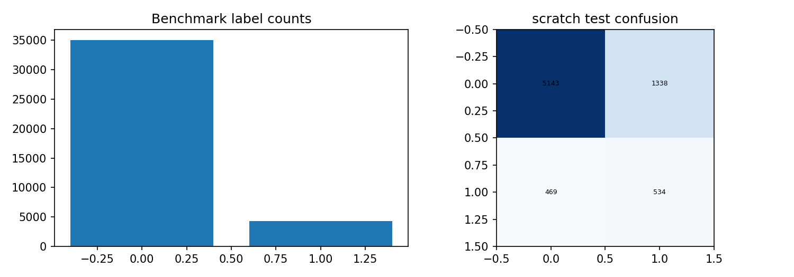

Tỷ lệ không mua lớn nên baseline lớp phổ biến có thể có Accuracy cao nhưng F1 lớp dương thấp. Weighted loss thay đổi ưu tiên khi học; không làm score trở thành xác suất đã calibration. AP vàROC-AUC bổ sung góc nhìn xếp hạng; Macro-F1 là tiêu chí chọn implementation trên validation trongtiểu luận.

Kết quả không chứng minh mô hình phát hiện người rời bỏ dài hạn. Khách không mua ở một tuần có thể mua ở tuần sau. Dođó giao diện và báo cáo đều dùng thuật ngữ “mua tuần kế tiếp” theo đúng định nghĩa nhãn.


# 4.10. Learning curve và chi phí RNN

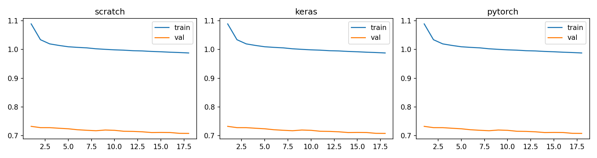

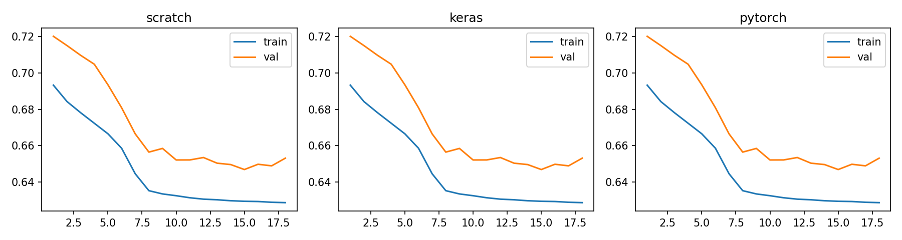

| Dataset / cài đặt | Tham số | Epoch tốt | Train giây |
| --- | --- | --- | --- |
| AAPL / scratch | 417 | 18 | 0.9002 |
| AAPL / keras | 417 | 18 | 1.9738 |
| AAPL / pytorch | 417 | 18 | 1.6210 |
| Online Retail II / scratch | 402 | 15 | 3.0378 |
| Online Retail II / keras | 402 | 15 | 6.7670 |
| Online Retail II / pytorch | 402 | 15 | 9.1446 |

Số tham số bằng nhau giữa ba cách cài đặt do cùng một bias recurrent và cùng head. Thời gian là số đo mô tả trên CPU, chưa có warm-up hoặc lặp benchmark nhiều lần. Không suy ra mọi RNN scratch đều nhanh/chậm hơn framework từ cấu hình nhỏ này.


# 4.11. Phân tích sai số và dịch chuyển thời gian

| Chỉ số | Thực | Dự đoán | Sai số / score |
| --- | --- | --- | --- |
| 2503 | 198.8500 | 172.6090 | 26.2410 |
| 2499 | 203.1900 | 223.5614 | 20.3714 |
| 2500 | 188.3800 | 203.9194 | 15.5394 |
| 2296 | 207.1500 | 193.5691 | 13.5809 |
| 2525 | 210.7900 | 198.9008 | 11.8892 |
| 2481 | 227.4800 | 239.0199 | 11.5399 |

| Chỉ số | Thực | Dự đoán | Sai số / score |
| --- | --- | --- | --- |
| 31887 | 0.0000 | 1.0000 | 0.8201 |
| 31888 | 0.0000 | 1.0000 | 0.5607 |
| 31893 | 0.0000 | 1.0000 | 0.7380 |
| 31898 | 1.0000 | 0.0000 | 0.5400 |
| 31906 | 0.0000 | 1.0000 | 0.6278 |
| 31911 | 0.0000 | 1.0000 | 0.5870 |

Bảng AAPL ưu tiên các sai số giá lớn nhất; bảngkhách hàng liệt kê ví dụ dự đoán sai đầu tiên trong test của implementation đã chọn. Chỉ số tham chiếu cache được lưu để có thể mở lại input. Không dùng những hàng này để đổi checkpoint.

Thị trường và hành vi khách hàng có thể thay đổi theo thời gian. Mean/std train cố định không xóa được distribution shift, nhưng fit lại bằng toàn test sẽ tạo một đánh giá không phù hợp với thời điểm dự đoán. Trong triển khai thực tế cần theo dõi thống kê đầu vào và chất lượng khi có nhãn mới; tiểu luận chưa xây dựng vòng tự tái huấn luyện.

Input khách hàng gồm các tổng tuần, không chứa các chiến dịch, mùa khuyến mại hoặc thông tin cá nhân bổ sung. AAPL chỉ có OHLCV, không có tin tức. Vì vậy không quy lỗi một mẫu cụ thể cho một sự kiện không quan sát được trong dataset. Những suy luận nguyên nhân cần nguồn dữ liệu khác và phương pháp kiểm định phù hợp.


# 4.12. Tiểu kết RNN

Chương 4 đã xây dựng một Vanilla RNN many-to-one và triển khai BPTT bằng NumPy. Hai framework thực hiện cùng recurrence và cùng quy tắc tối ưu. Hai dataset bao phủ regression giá phiên kế tiếp và classification mua tuần kế tiếp, với target được định nghĩa theo thời điểm rõ ràng.

Điểm quan trọng của thực nghiệm là giữ đúngquan hệ quá khứ-tương lai và ghi rõ dạng rolling one-step. Các quan sát trước nhãn được sử dụng, còn nhãn tương lai không được đưa vào scaler hoặc window. Việc cùng khách xuất hiện trong nhiều giai đoạn là đặc điểm thiết kế của bài mua lại, không phải phép thử khách hoàn toàn mới.

Baseline và phân tích lỗi giúp tránh diễn giải quá mức metric. Ba framework tạo kết quả gần nhau chứng tỏ tính nhất quán của phép triển khai dưới điều kiện hiện tại; nó không giải quyết giới hạn thông tin trong lịch sử. Một mạng có gate hoặc một bộ dữ liệu lớn hơn chỉ có ý nghĩa nếu được kiểm tra bằng protocol phù hợp.

Hướng phát triển tiếp theo gồm nhiều seed, walk- forward validation, phân tích drift, calibration score và đối chiếu với mô hình chuỗi đơn giản. Tất cả là công việc chưa thực hiện, được tách rõ khỏi kết quả của 18 model đã train trongtiểu luận. Checkpoint hiện tại được sử dụng nguyên vẹn trong web để người dùng thử cùng phạm vi input.

| Quy tắc | Cách áp dụng |
| --- | --- |
| Không nhìn tương lai | Window kết thúc trước target |
| Chọn model | Validation Macro-F1 hoặc RMSE |
| Phục vụ | Cùng mean/std và trọng số export |
| Phạm vi | Một bước; một seed; không online learning |


# 5. TRIỂN KHAI - 5.1. Kiến trúc ứng dụng

Ứng dụng Flask cung cấp sáu bài toán trong một giao diện: CDC, giá nhà, MNIST, EuroSAT, AAPL và mua lại. Mỗi bài toán có ba lựa chọn implementation đã train. Các model không được huấn luyện lại khi có request; server chỉ đọc bundle và tính forward. Mẫu test lịch sử được gắn nhãn thật riêng để người dùng đối chiếu.

Luồng xử lý gồm chọn dataset / framework, xác thực input, tiền xử lý theo thống kê train, chạy NumPy forward, khôi phục đơn vị hoặc softmax, rồi trả JSON. Trọng số của Keras / PyTorch được export sang cùng định dạng; checkpoint native vẫn được lưu để kiểm tra lại. Đây là phục vụ trọng số thật, không phải train một model mô phỏng thay thế.

Việc chỉ cài NumPy, Pillow và Flask giúp bản web nhẹ hơn gói huấn luyện chứa TensorFlow và PyTorch. Cách triển khai phải được xác minh số học vì một sai trụcflatten hoặc khác preprocessing có thể làm output sai dù giao diện hoạt động bình thường. Bộ kiểm tra so native checkpoint và portable forward trên mẫu chưa dùng fit.

| Lớp | Thành phần | Trách nhiệm |
| --- | --- | --- |
| Giao diện | HTML /CSS/JavaScript | Chọn bài, nhập mẫu/ảnh/ CSV, xem kết quả |
| API | Flask | Kiểm tra payload và định tuyến model |
| Suy luận | NumPy + Pillow | Chuẩn hóa, forward và output |
| Artifact | NPZ + JSON + native checkpoint s | Trọng số và metadata có thể kiểm chứng |

Repository: https://github.com/Vinhdiesel28/tieuluan. Tệp render.yaml mô tả web service Free trên Render, chạy Gunicorn và health check /health.


# 5.2. Hợp đồng đầu vào và giới hạn sử dụng

| Bài toán | Input | Output |
| --- | --- | --- |
| CDC | Một dòng 21 predictor theo mã nguồn | Hai lớp: no diabetes / prediabetes-or-diabetes |
| Giá nhà | Một dòng 6 predictor số | Giá ước lượng tỷ VND |
| MNIST | Ảnh một chữ số, sáng trên nền tối | Một trong 10 chữ số |
| EuroSAT | ẢnhRGB miền vệ tinh | Một trong 10 lớp phủ đất |
| AAPL | CSV ≥80 phiên OHLCV và Date | Closephiên tiếp theoUSD |
| Khách hàng | 8 tuần× 6 đặc trưng, tiền GBP | Có mua tuần kế tiếp hay không |

Inputmới phải có cùng định nghĩa với dữ liệu train. Một mã tuổi khảo sát khác với tuổi tính bằng năm; giá rao bán khác giá giao dịch; số đơn theo tuần khác tổng đơn cảtháng. Vì vậy, tên cột, đơn vị và số bước được thể hiện trong hướng dẫn. Các tệp có NaN, kích thước sai hoặc tên model ngoài danh sách được từ chối thay vì âm thầm tạo kết quả.

Score softmax chưa được calibration; giá trị cao không bảo đảm dự đoán đúng. Web là minh họa học thuật cho pipeline đã chạy, chưa có kiểm chứng sử dụng vào chẩn đoán, định giá hay quyết định đầu tư. Không thu thập danh tính khách hàng trong mẫu demo; các tổng tuần được dùng để minh họa chuỗi.

Ảnh được resize 16 × 16 bằngbilinear, chuyển kênh theo dataset và chuẩn hóa cùng train. Với CSV, headerđược đối chiếu, ngày AAPL phải tăng dần. Giao diện cho phép dùng mẫu tích hợp để người chấm dễ xác nhận các chức năng trước khi nhập dữ liệu riêng.


# 5.3. Kiểm chứng và trạng thái deploy

| Kiểm tra | Kết quả |
| --- | --- |
| Gradient scratch | MLP, CNN, RNN: finite differences và autograd |
| Model native /portable | 18 checkpoint được xác minh |
| API hợp lệ | 162 yêu cầu thành công |
| API lỗi | 6 trường hợp trả 400 |
| Notebook | 5 notebook đủ output, không cell lỗi |

Kiểm thử metric tính lại từ dự đoán đã lưu vàso với JSON của từng model. Checkpoint được nạp lại, đối chiếu cùng input để tránh tình huống báo cáo dùng trọng số khác web. Các split được kiểm tra không giao nhau; dữ liệu chuỗi còn kiểm tra thứ tựthời gian train trước validation trước test.

Cấu hình Render có build commandcài requirements- web.txt, start Gunicorn vàhealthendpointtrả số lượng 18 model. Có file cấu hình không tự đồng nghĩa đã có URLonline. Trạng thái thực tế phải được xác nhận từ dịch vụ bên ngoài, tách biệt với việc API chạy đúng trong test clienthoặcmáy cá nhân.

Trạng thái tại lúc xuất báo cáo: đã chuẩn bị Blueprint và kiểm tra local; chưa xác nhận URL Render live vì cần phiên đăng nhập tài khoản.

Các bước tái lập nằm trong README và docs/DEPLOY.md. Raw data được lấy từ nguồn công khai hoặc tệp đã cung cấp, đối chiếu SHA-256 trong manifest. Các bảng kết quả trong báo cáo được đọc trực tiếp từ tệp do notebook tạo, không nhập tay một bảng kết quả của tác giả khác.


# KẾT LUẬN

Tiểu luận đã kết nối lịch sửAI với ba nhóm mô hình học từ dữ liệu và một ứng dụng phục vụ checkpoint. Phần lịch sử làm rõ vai trò của cách đặt câu hỏi, biểu diễn, dữ liệu và compute. Phần thực nghiệm cho thấy công thức toán học có thể chuyển thành code và được kiểm chứng bằng các phép đối chiếu cụ thể.

Sáu dataset được mô tả theo nguồn, quy mô, cách hình thành mẫu, phân bố và giới hạn. Mười tám implementation được train độc lập từ đầu: MLP, CNN vàVanilla RNN, mỗi loại trên hai dataset bằngscratch/ Keras / PyTorch. Bốn baseline cổ điển bổ sung cho chươngML. Scratchthực hiệnđạo hàm và SGD thật; finite differencescùng hai autogradcung cấp bằng chứng về tính nhất quán của phần cài đặt.

Kết quả gần nhau giữa framework phù hợp với thiết kế cùngkhởi tạo và cùng phép cập nhật. Điều này không cónghĩa cả ba môi trườngluôn tương đương về hiệu quả tính toán, và cũng khôngchứng minh mô hình đủ tốt trong mọi miền. Baseline, confusion matrixvàví dụ lỗi giúp đặt chất lượng dự đoán trong bối cảnh của từng dataset.

Web cho phép thửsáu bài toán bằng model đã train và đầu vào cụ thể. Mộtphần quan trọng của sản phẩm là lưu đúng scaler, target transformvà checkpoint, thay vì chỉ dựng giao diện. Hướng nghiên cứu sau cầnnhiều seed, đánh giá ngoài miền, calibration vàmonitoring; những nội dung chưa làm được nêu rõ để tránh diễn giải quá mức phạm vi tiểu luận.

| Chương | Dataset | Sản phẩm chính |
| --- | --- | --- |
| ML | CDC, giá nhà | MLP × 3 cài đặt + baseline |
| CNN | MNIST, EuroSAT | Forward/ backward CNN + metric |
| RNN | AAPL, khách hàng | BPTT + split thời gian + baseline |
| Deploy | Sáu bài toán | Flask + trọng số thật + Render YAML |


# TÀI LIỆU THAM KHẢO

[1] A. M. Turing (1950). Computing Machinery and Intelligence. Mind 59(236), 433-460. https://doi.org/10.1093/mind/LIX.236.433

[2] J. McCarthy, M. Minsky, N. Rochester, C. Shannon (1955). A Proposal for the Dartmouth Summer Research Project on Artificial Intelligence. https://www-formal.stanford.edu/jmc/history/dartmouth/dartmouth.html

[3] D. Rumelhart, G. Hinton, R. Williams (1986). Learning representations by back-propagating errors. https://www.cs.toronto.edu/~hinton/absps/naturebp.pdf

[4] A. Krizhevsky, I. Sutskever, G. Hinton (2012). ImageNet Classification with Deep Convolutional Neural Networks. https://www.cs.toronto.edu/~hinton/absps/imagenet.pdf

[5] S. Hochreiter, J. Schmidhuber (1997). Long Short-Term Memory. https://www.bioinf.jku.at/publications/older/2604.pdf

[6] A. Vaswani et al. (2017). Attention Is All You Need. https://arxiv.org/abs/1706.03762

[7] Triệu Tuấn Anh. tieuluan 01_CT_08_anhtt.pdf. Bài mẫu do người dùng cung cấp; tham khảo bố cục và cách đối chiếu implementation, không sao chép kết quả.

[8] CDC Diabetes Health Indicators BRFSS 2015. https://www.kaggle.com/datasets/alexteboul/diabetes-health-indicators-dataset

[9] Vietnam Housing Dataset 2024. https://www.kaggle.com/datasets/nguyentiennhan/vietnam-housing-dataset-2024. Bản CSV được người học cung cấp từ bài trước, hash trong manifest.


# Tài liệu tham khảo (tiếp) và tái lập

[10] MNIST, bản phân phối tf.keras. https://storage.googleapis.com/tensorflow/tf-keras-datasets/mnist.npz; https://keras.io/api/datasets/mnist/

[11] P. Helber et al. EuroSAT. https://arxiv.org/abs/1709.00029; bản dữ liệu RGB: https://zenodo.org/records/7711810

[12] UCI Online Retail II. https://archive.ics.uci.edu/dataset/502/online+retail+ii; bản tải sử dụng trong repository dữ liệu [13].

[13] ISD_Assignment 01/A 06/ datasets. AAPL _2015_2025.csv và online_retail_II.xlsx. https://github.com/tuananhtrieu1305/ISD_Assignment01/tree/main/A06/datasets

[14] PyTorch documentation. https://docs.pytorch.org/; thực nghiệm PyTorch 2.7.1 CPU.

[15] Keras documentation. https://keras.io/api/layers/; thực nghiệm TensorFlow 2.20.0.

[16] Render. Deploy a Flask App / Blueprint YAML Reference. https://render.com/docs/deploy-flask; https://render.com/docs/blueprint-spec

[17] Nguyễn Minh Vinh. Mã nguồn và kết quả tiểu luận. https://github.com/Vinhdiesel28/tieuluan

Ngày đối chiếu nguồn: 08/10/2026. Các bảng số liệu và hình thực nghiệm được tạo từ lần chạy trong repository này. Không có mã gốc RNN /ML/ CNN của giảng viên được chỉ định làm bản bắt buộc cho tiểu luận; các đoạn trình bày là code tự triển khai hoặc API thư viện được dẫn nguồn.
